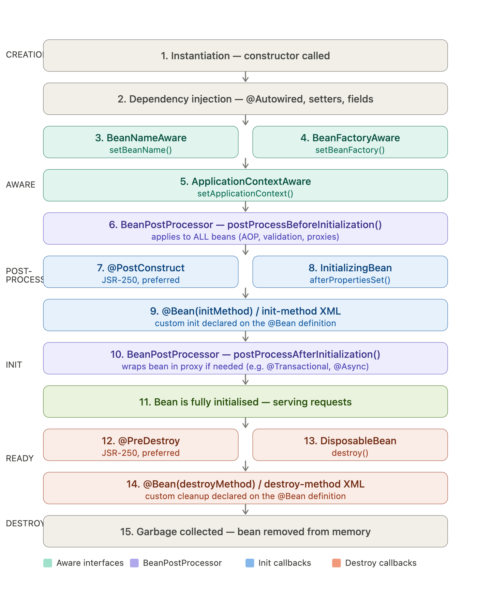

```java
2026-03-19T17:24:49.034+01:00  INFO 1847 --- [bean-lifcycle] [  restartedMain] o.beanlifcycle.BeanLifcycleApplication   : Starting BeanLifcycleApplication using Java 21.0.8 with PID 1847 
        (/Users/hunorvadasz-perhat/Documents/GitHub/spring-prep/bean-lifcycle/target/classes started by hunorvadasz-perhat in /Users/hunorvadasz-perhat/Documents/GitHub/spring-prep)
2026-03-19T17:24:49.037+01:00  INFO 1847 --- [bean-lifcycle] [  restartedMain] o.beanlifcycle.BeanLifcycleApplication   : No active profile set, falling back to 1 default profile: "default"
2026-03-19T17:24:49.078+01:00  INFO 1847 --- [bean-lifcycle] [  restartedMain] .e.DevToolsPropertyDefaultsPostProcessor : Devtools property defaults active! Set 'spring.devtools.add-properties' to 'false' to disable
2026-03-19T17:24:49.078+01:00  INFO 1847 --- [bean-lifcycle] [  restartedMain] .e.DevToolsPropertyDefaultsPostProcessor : For additional web related logging consider setting the 'logging.level.web' property to 'DEBUG'
2026-03-19T17:24:49.828+01:00  INFO 1847 --- [bean-lifcycle] [  restartedMain] o.s.b.w.embedded.tomcat.TomcatWebServer  : Tomcat initialized with port 1111 (http)
2026-03-19T17:24:49.840+01:00  INFO 1847 --- [bean-lifcycle] [  restartedMain] o.apache.catalina.core.StandardService   : Starting service [Tomcat]
2026-03-19T17:24:49.841+01:00  INFO 1847 --- [bean-lifcycle] [  restartedMain] o.apache.catalina.core.StandardEngine    : Starting Servlet engine: [Apache Tomcat/10.1.52]
2026-03-19T17:24:49.868+01:00  INFO 1847 --- [bean-lifcycle] [  restartedMain] o.a.c.c.C.[Tomcat].[localhost].[/]       : Initializing Spring embedded WebApplicationContext
2026-03-19T17:24:49.869+01:00  INFO 1847 --- [bean-lifcycle] [  restartedMain] w.s.c.ServletWebServerApplicationContext : Root WebApplicationContext: initialization completed in 791 ms
1  [Constructor]        Bean instantiated
2  [Setter injection]   message = "Hello from Spring 3.5 + Java 21"
3  [BeanNameAware]      bean name = "lifecycleBean"
4  [BeanFactoryAware]   factory = DefaultListableBeanFactory
5  [ApplicationContextAware] context = AnnotationConfigServletWebServerApplicationContext
6  [BPP before init]   postProcessBeforeInitialization("lifecycleBean")
7  [@PostConstruct]     JSR-250 init, preferred approach
8  [InitializingBean]   afterPropertiesSet()
9  [initMethod]         customInit() via @Bean(initMethod)
10 [BPP after init]    postProcessAfterInitialization("lifecycleBean") — proxy could be returned here
2026-03-19T17:24:50.146+01:00  INFO 1847 --- [bean-lifcycle] [  restartedMain] o.s.b.d.a.OptionalLiveReloadServer       : LiveReload server is running on port 35729
2026-03-19T17:24:50.171+01:00  INFO 1847 --- [bean-lifcycle] [  restartedMain] o.s.b.w.embedded.tomcat.TomcatWebServer  : Tomcat started on port 1111 (http) with context path '/'
2026-03-19T17:24:50.178+01:00  INFO 1847 --- [bean-lifcycle] [  restartedMain] o.beanlifcycle.BeanLifcycleApplication   : Started BeanLifcycleApplication in 1.544 seconds (process running for 1.95)

=== Bean in use — ACTIVE phase ===

11 [In use]             doWork() called — message: "Hello from Spring 3.5 + Java 21"

=== Context closing — DESTROY phase ===

2026-03-19T17:24:50.183+01:00  INFO 1847 --- [bean-lifcycle] [  restartedMain] o.s.b.w.e.tomcat.GracefulShutdown        : Commencing graceful shutdown. Waiting for active requests to complete
2026-03-19T17:24:50.190+01:00  INFO 1847 --- [bean-lifcycle] [tomcat-shutdown] o.s.b.w.e.tomcat.GracefulShutdown        : Graceful shutdown complete
12 [@PreDestroy]        JSR-250 cleanup, preferred approach
13 [DisposableBean]     destroy()
14 [destroyMethod]      customDestroy() via @Bean(destroyMethod)

Process finished with exit code 0
```