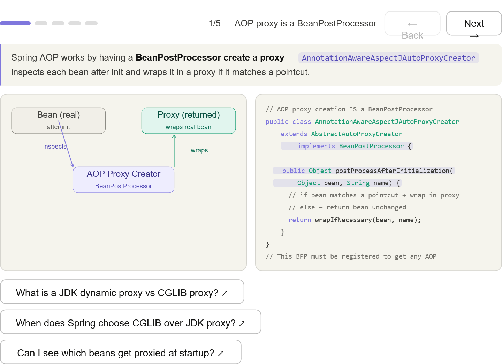
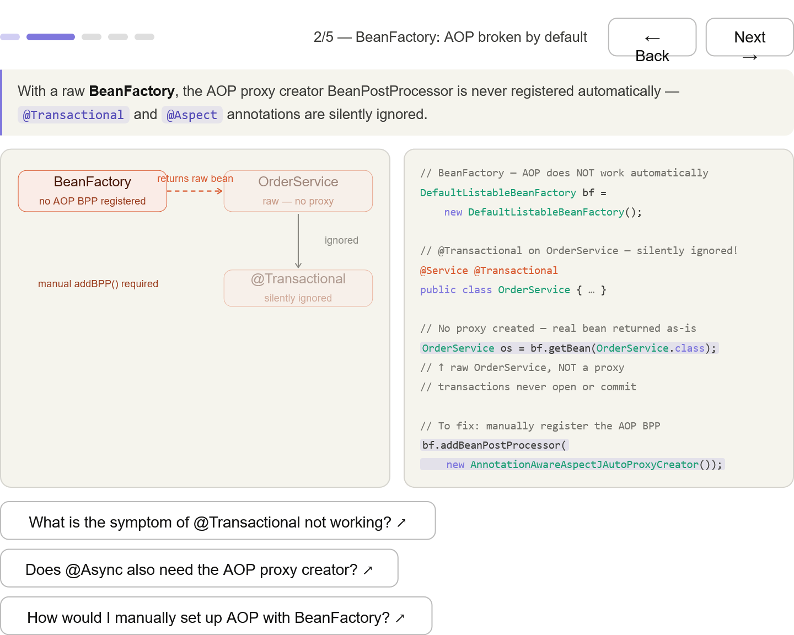
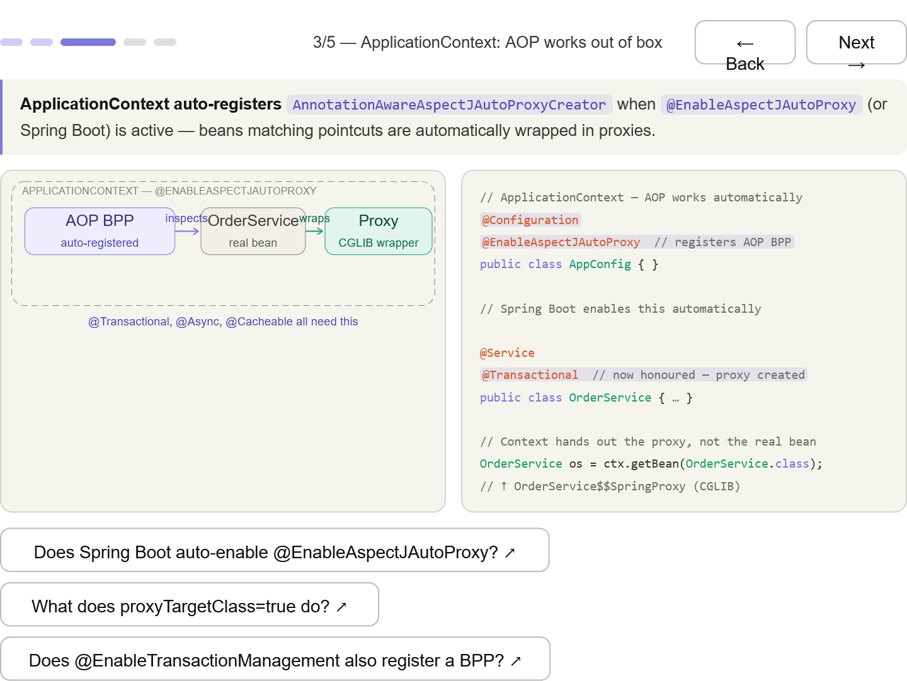
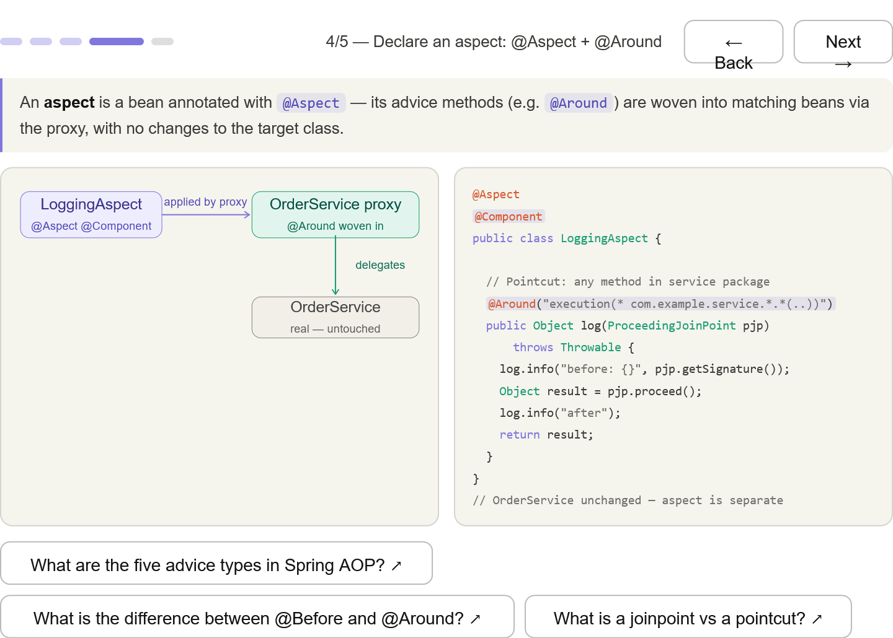
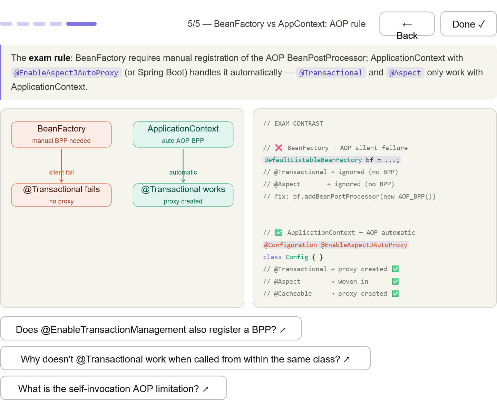

*** 
## AOP is a BeanPostProcessor — AnnotationAwareAspectJAutoProxyCreator implements BeanPostProcessor and replaces beans with proxies in postProcessAfterInitialization

*** 
## BeanFactory: AOP broken — the AOP BPP is never auto-registered; @Transactional and @Aspect are silently ignored; the raw bean is returned unchanged

*** 
## ApplicationContext: AOP automatic — @EnableAspectJAutoProxy triggers auto-registration; every matching bean gets a CGLIB proxy at startup

*** 
## Declare an aspect — @Aspect @Component + @Around with a pointcut expression; OrderService is untouched, aspect is completely separate

*** 
## Exam contrast — the definitive side-by-side: BeanFactory = silent AOP failure, ApplicationContext = automatic proxying for @Transactional, @Aspect, @Cacheable

*** 