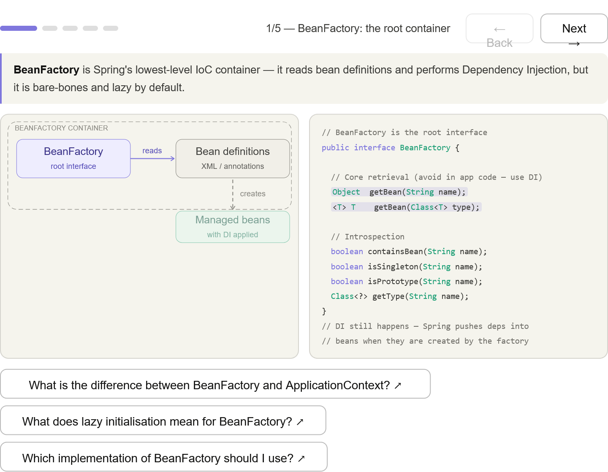
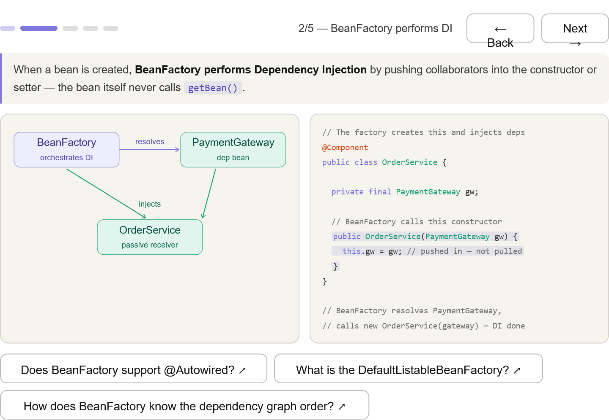
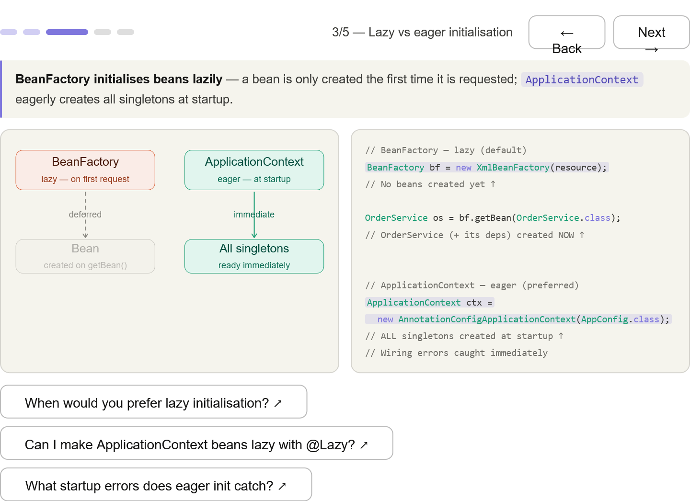
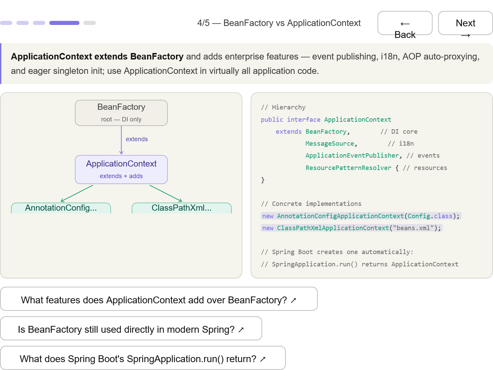
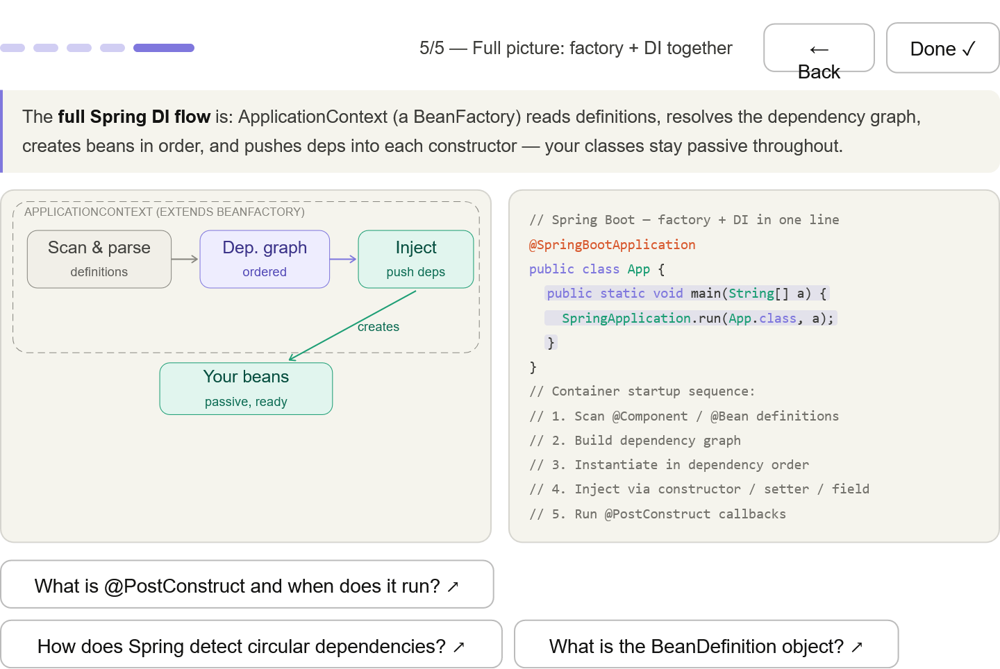

***
## BeanFactory interface — the root contract; getBean() is there but DI still happens internally when beans are created

***
## How DI works inside the factory — factory resolves PaymentGateway, then calls new OrderService(gateway); your class stays passive

***
## Lazy vs eager — the key exam distinction: BeanFactory creates on first request; ApplicationContext creates all singletons at startup (catches wiring errors early)

***
## ApplicationContext extends BeanFactory — the interface hierarchy plus the two concrete implementations you'll see on the exam (AnnotationConfigApplicationContext, ClassPathXmlApplicationContext)

***
## Full startup sequence — scan → graph → instantiate → inject → @PostConstruct; the five-step mental model the exam expects

***