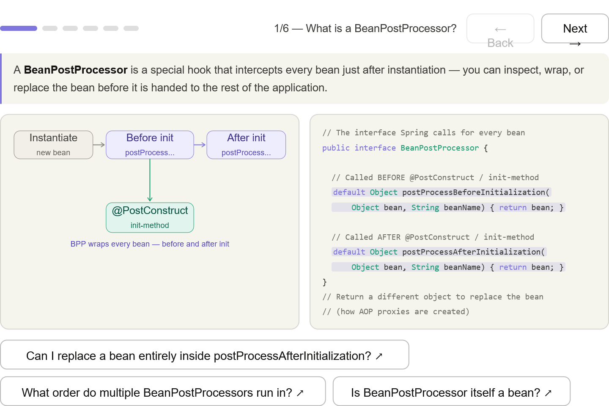
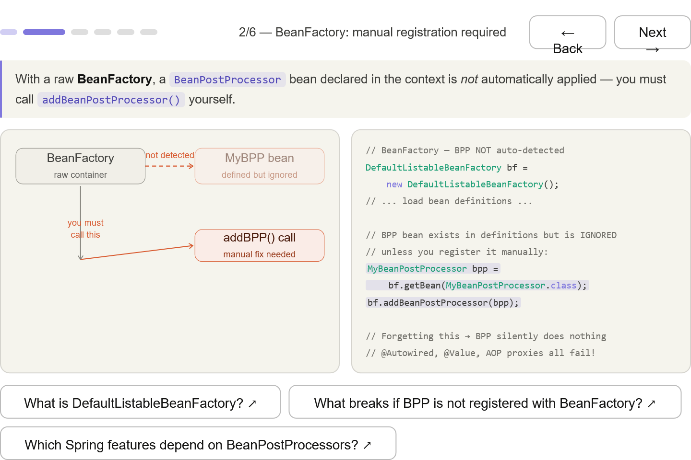
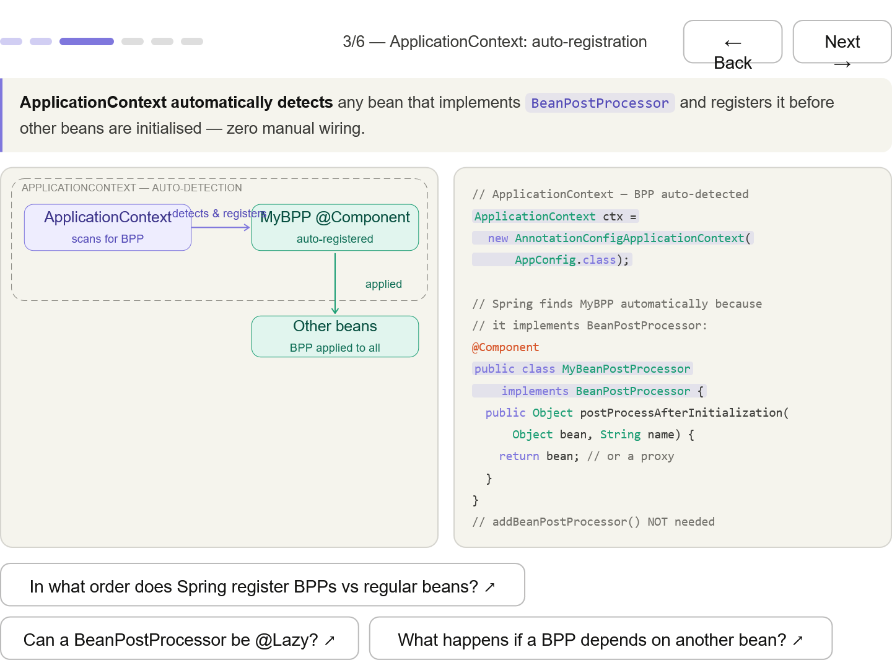
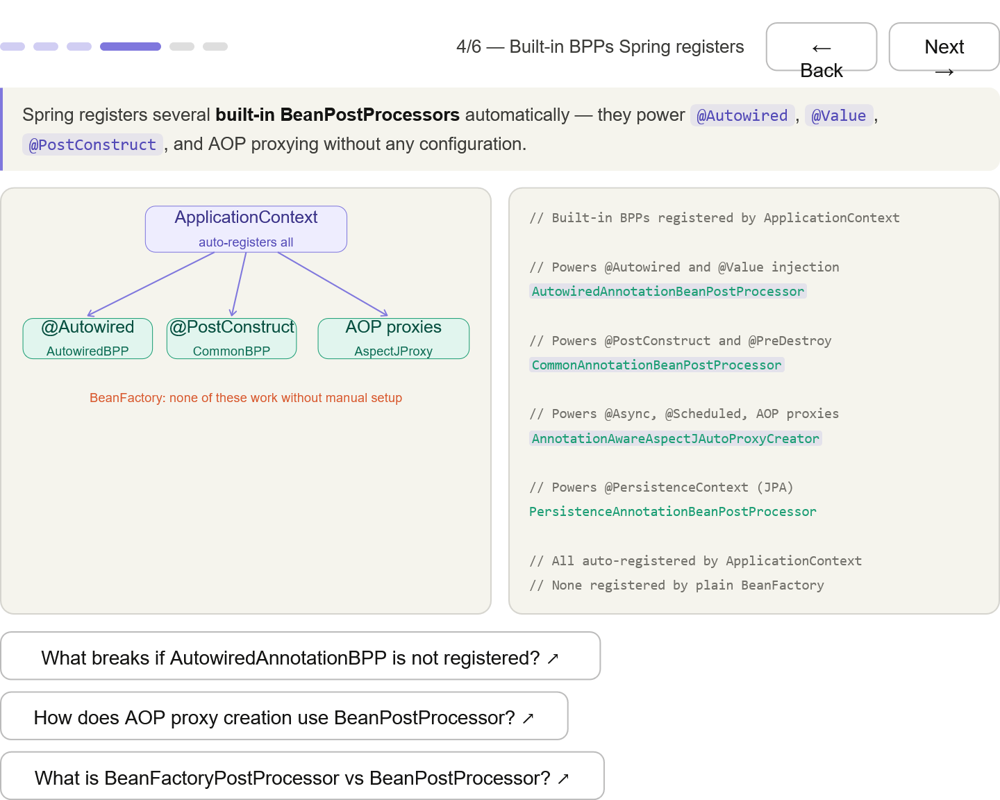
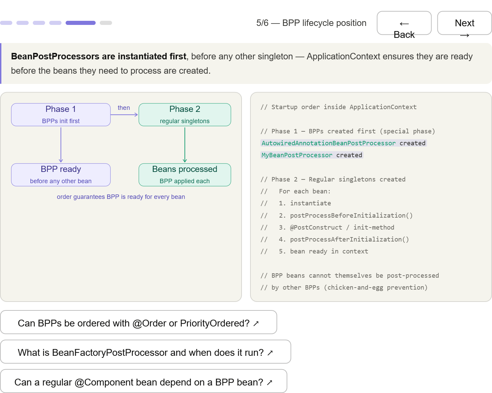
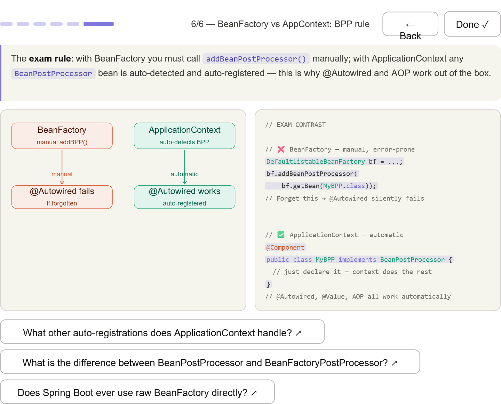

*** 
## What BPP does — the two hook methods (Before/AfterInitialization), their position relative to @PostConstruct, and how returning a different object replaces the bean (how AOP works)

*** 
## BeanFactory: manual — addBeanPostProcessor() must be called explicitly; forgetting it silently breaks @Autowired, @Value, and AOP

*** 
## ApplicationContext: automatic — just declare @Component implementing BeanPostProcessor; the context detects and registers it before all other beans

*** 
## Built-in BPPs — AutowiredAnnotationBeanPostProcessor, CommonAnnotationBeanPostProcessor, AnnotationAwareAspectJAutoProxyCreator — all auto-registered by ApplicationContext, none by BeanFactory

*** 
## Lifecycle position — BPPs are instantiated in Phase 1 before any regular singleton, guaranteeing they're ready to intercept all bean creations

*** 
## Exam contrast — coral BeanFactory (manual, fragile) vs teal ApplicationContext (automatic), the exact framing the exam uses

*** 