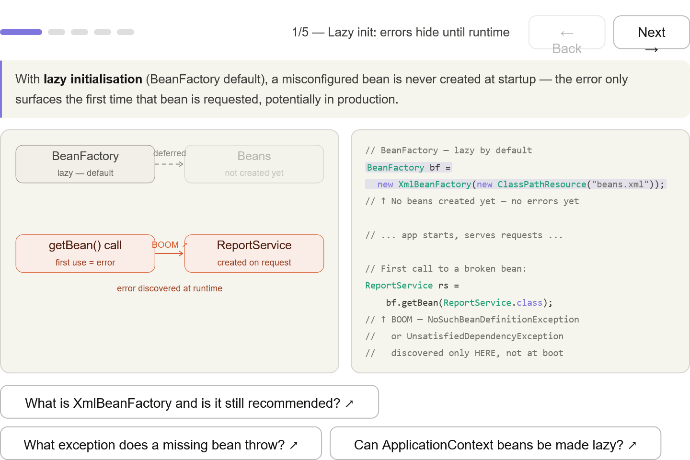
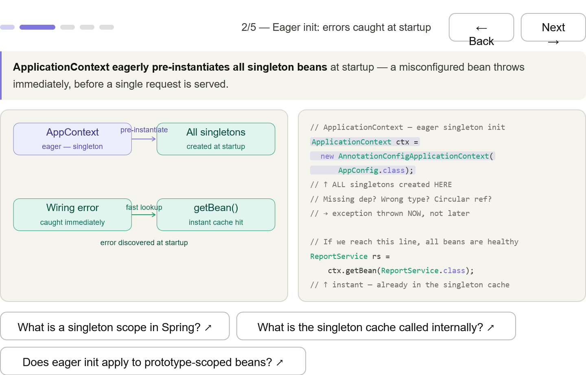
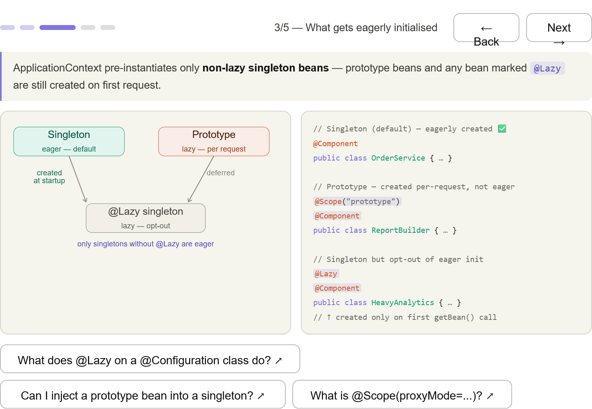
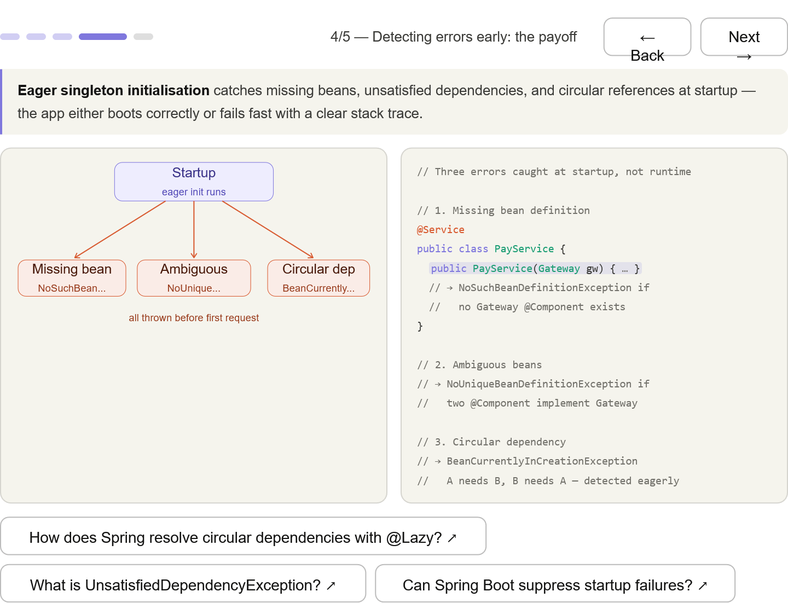
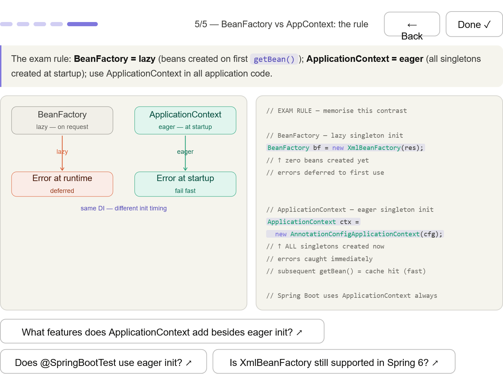

***
## The lazy problem — BeanFactory defers creation; a broken bean hides until first use, possibly in production

***
## Eager init payoff — ApplicationContext pre-instantiates all singletons at startup; if you reach the next line, all beans are healthy

***
## What gets eagerly initialised — only non-lazy singletons; @Scope("prototype") and @Lazy still defer

***
## Three errors caught at startup — NoSuchBeanDefinitionException, NoUniqueBeanDefinitionException, and BeanCurrentlyInCreationException (circular ref) — all surface before the first request

***
## The exam rule — the side-by-side contrast the 2V0-72.22 expects: BeanFactory = lazy, ApplicationContext = eager, same DI — different timing

***
