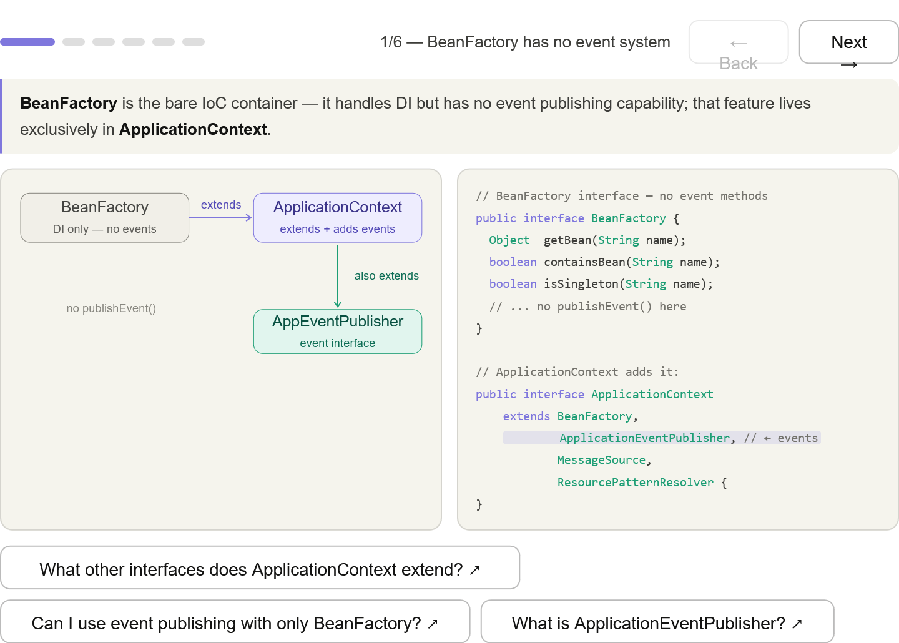
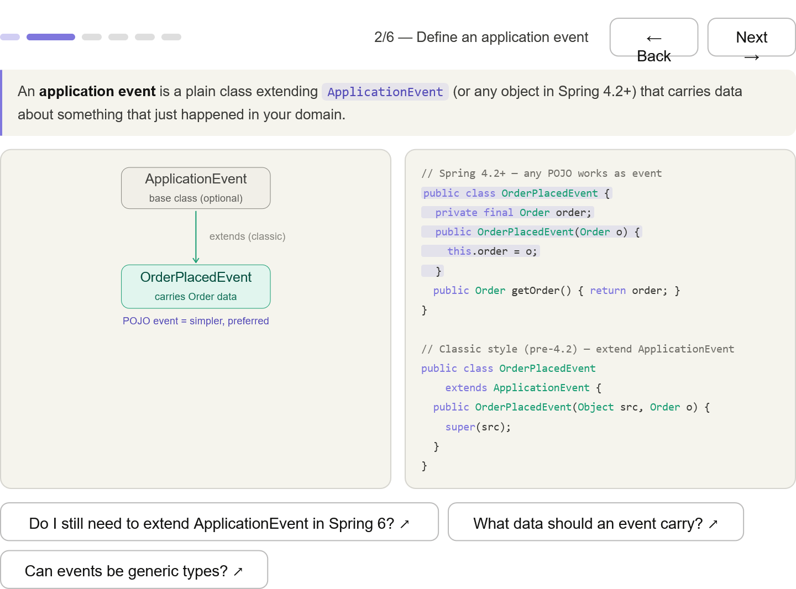
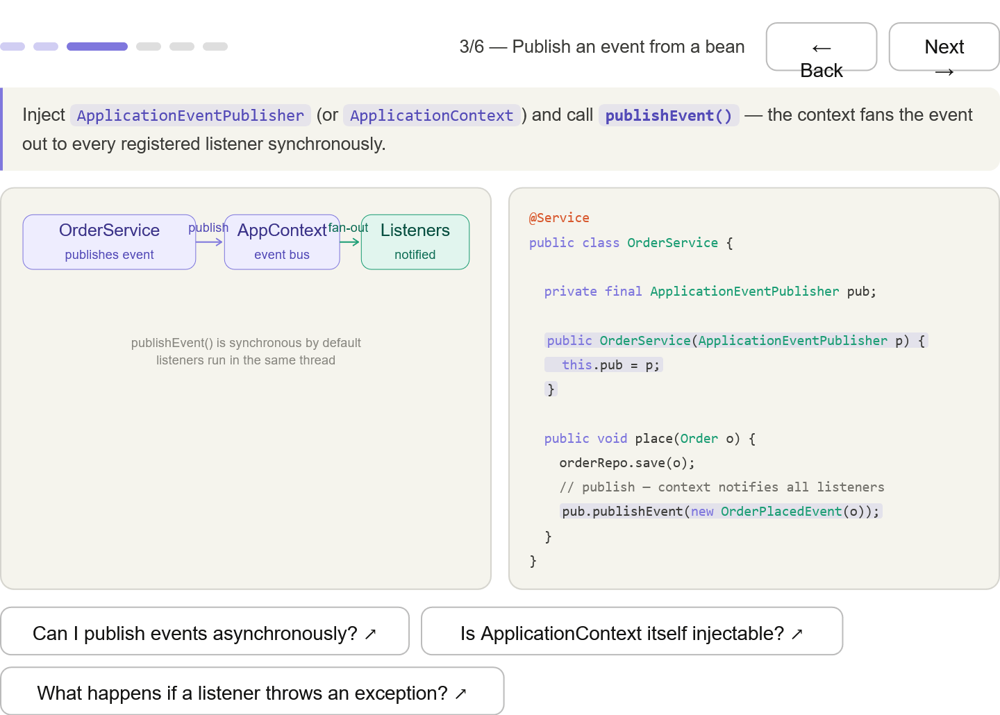
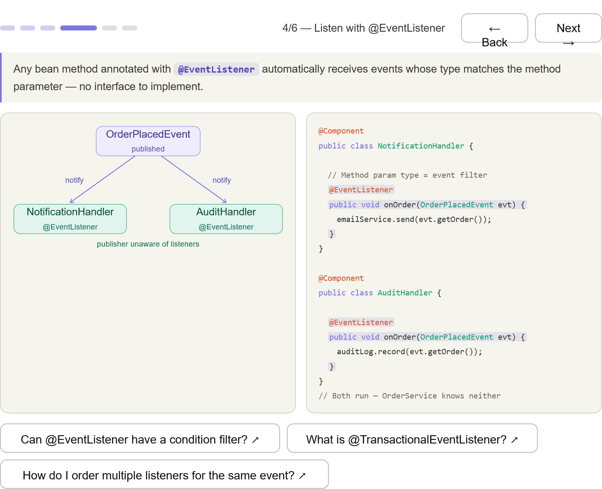
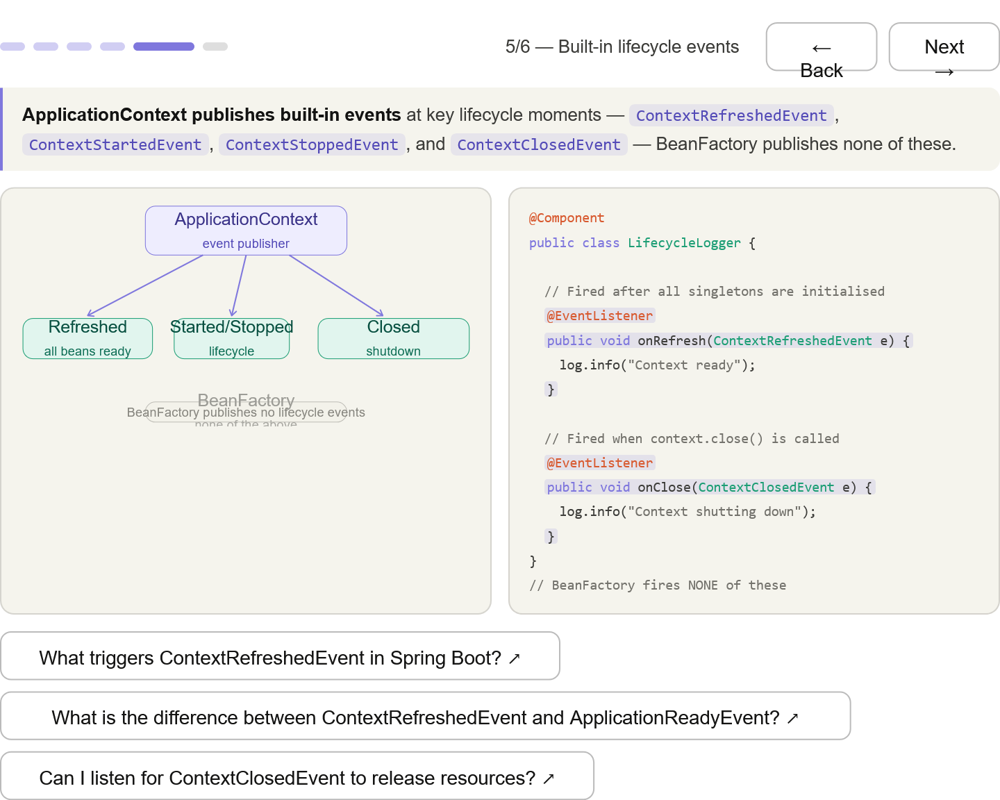
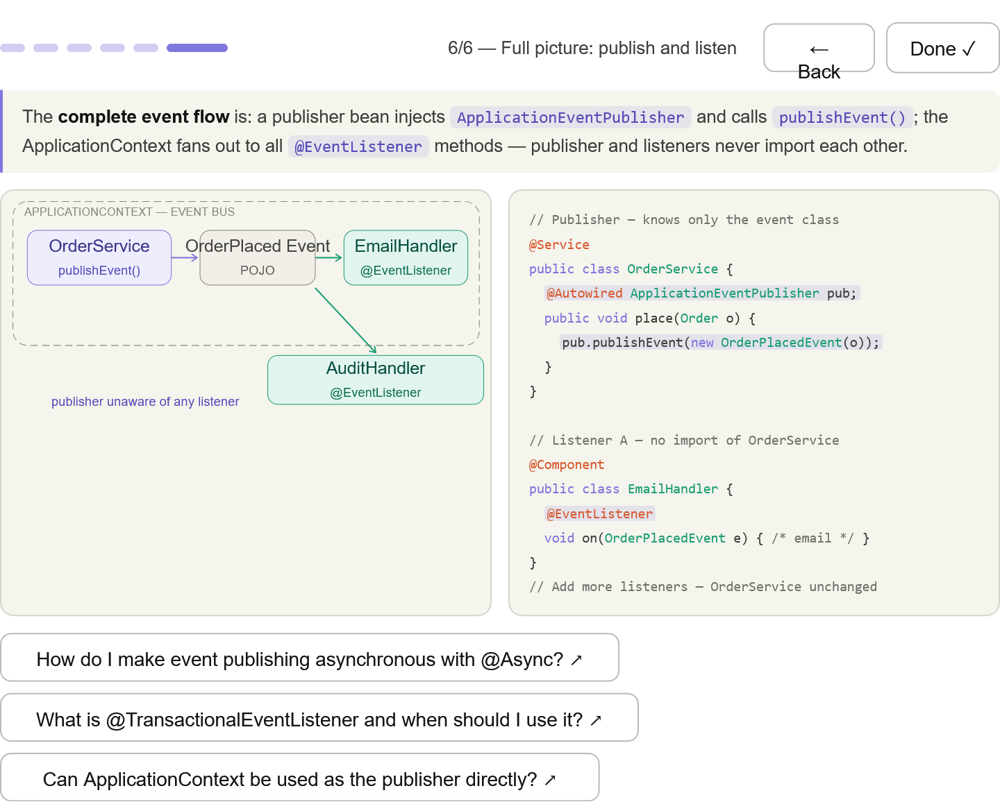

***
## BeanFactory has no events — the interface hierarchy shows ApplicationEventPublisher is only on ApplicationContext, not BeanFactory

***
## Define an event — plain POJO (Spring 4.2+) vs classic ApplicationEvent extension; both shown

***
## Publish with publishEvent() — inject ApplicationEventPublisher, call it after the business action; context fans out synchronously

***
## Listen with @EventListener — method parameter type is the filter; multiple listeners receive the same event; publisher imports neither

***
## Built-in lifecycle events — ContextRefreshedEvent, ContextClosedEvent, etc.; the exam answer is "BeanFactory fires none of these"

***
## Full picture — publisher → event POJO → context → multiple @EventListener methods; the key insight is zero coupling between publisher and listeners

***