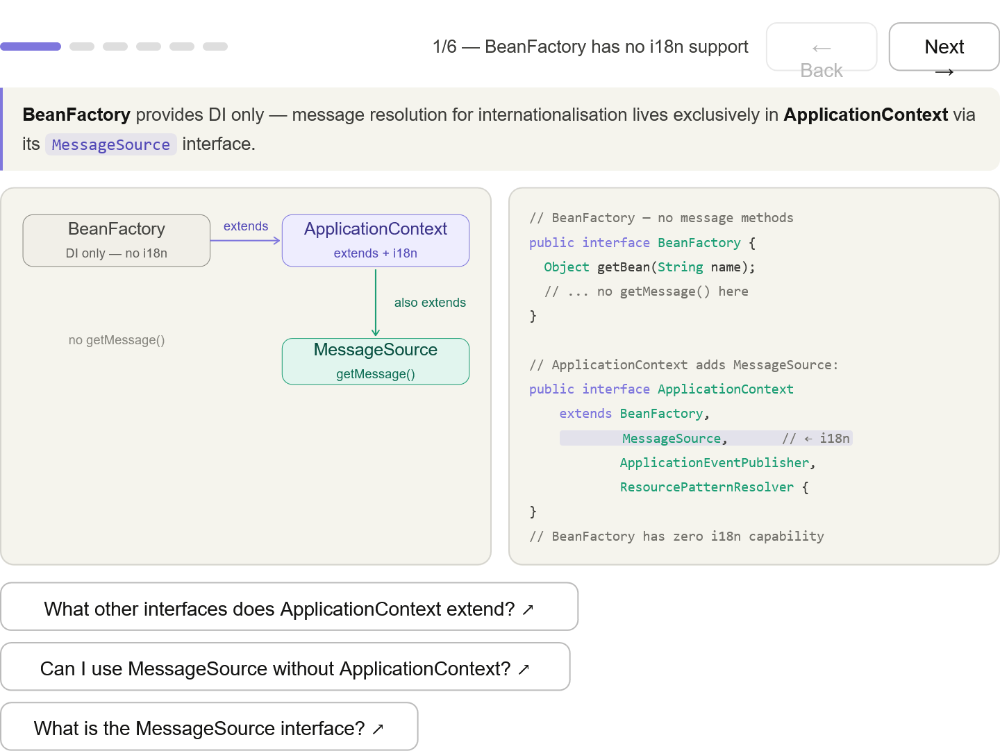
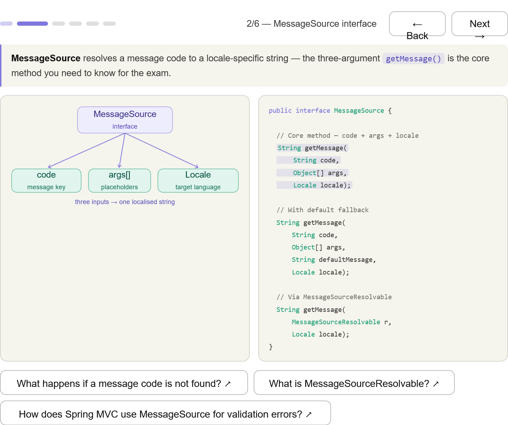
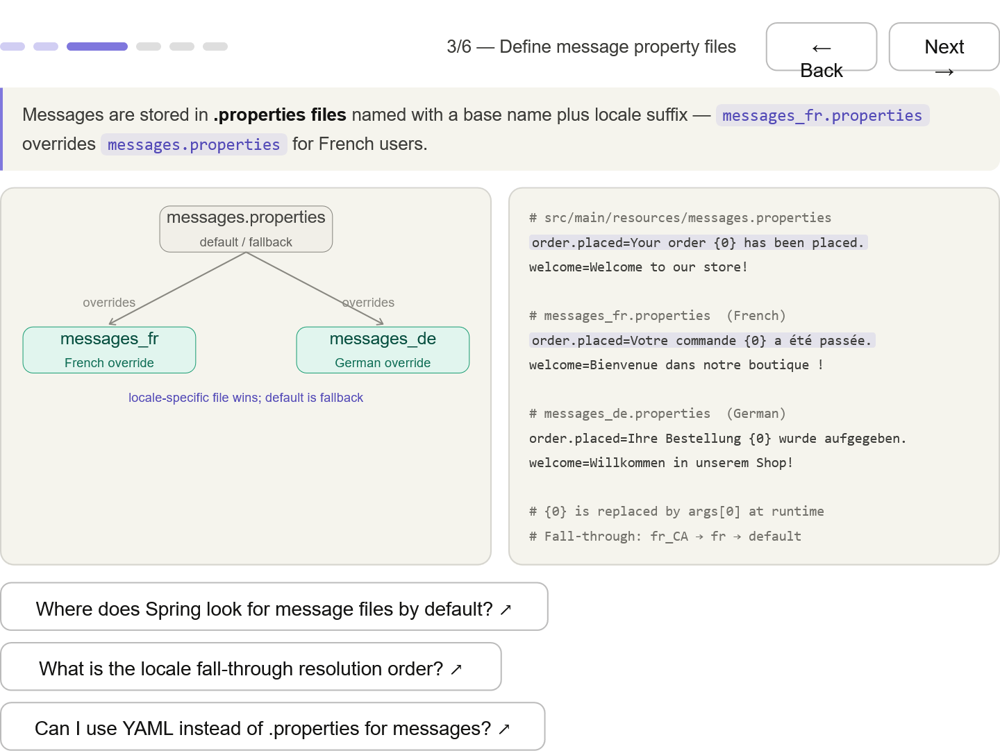
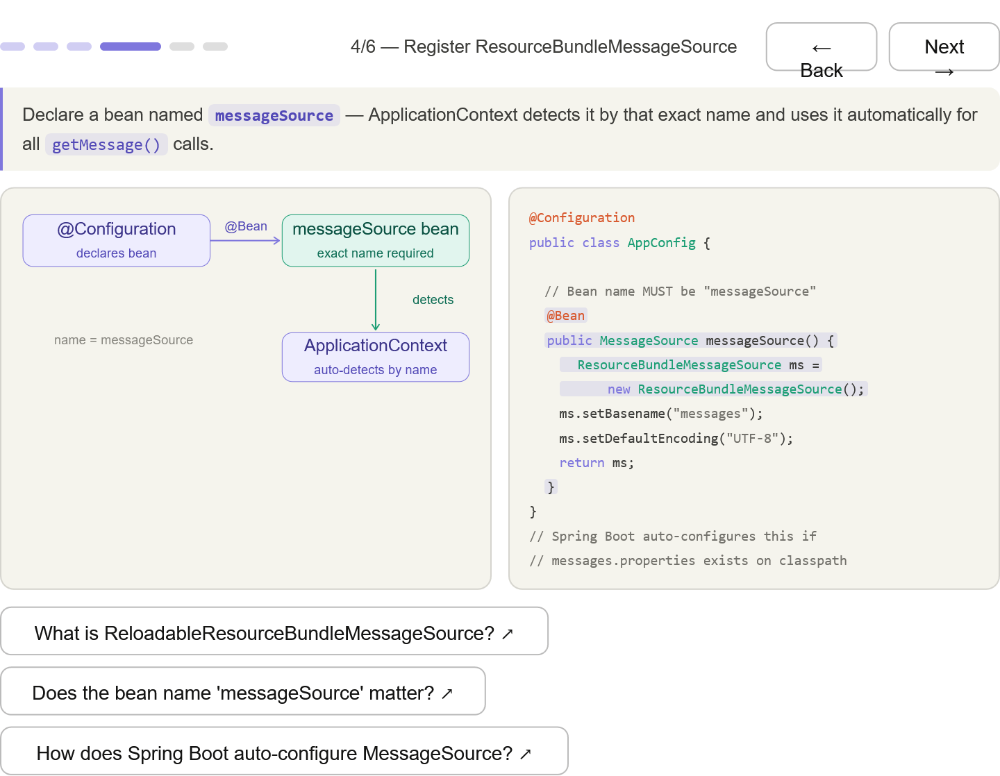
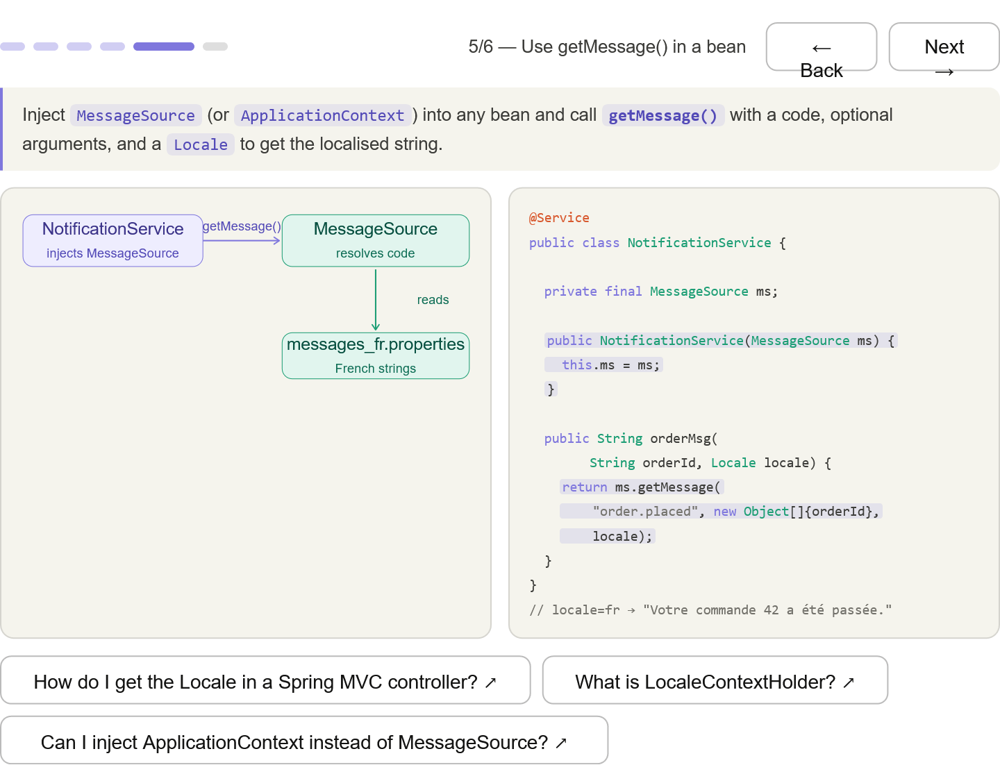
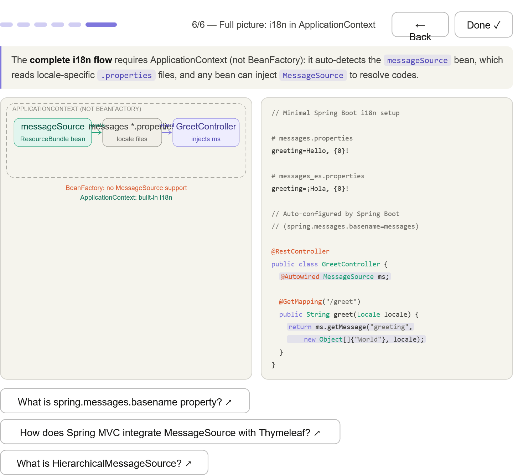

***
## BeanFactory has no i18n — the interface hierarchy: MessageSource is on ApplicationContext, not BeanFactory

***
## MessageSource interface — the three key overloads; the exam focuses on getMessage(code, args[], locale)

***
## Properties files — messages.properties as default, messages_fr.properties as override; locale fall-through chain

***
## Register the bean — the bean name must be exactly "messageSource"; ApplicationContext auto-detects it by name

***
## Inject and call — inject MessageSource via constructor, call getMessage() with a live Locale

***
## Full picture — the complete flow inside an ApplicationContext boundary, with the exam-critical footer: "BeanFactory: no MessageSource support"

***