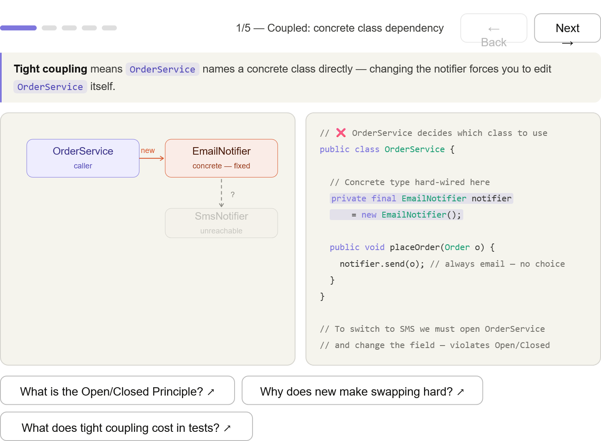
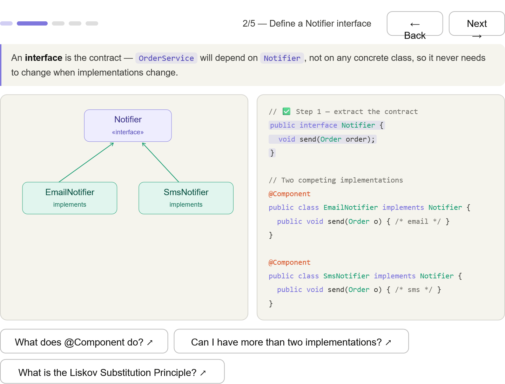
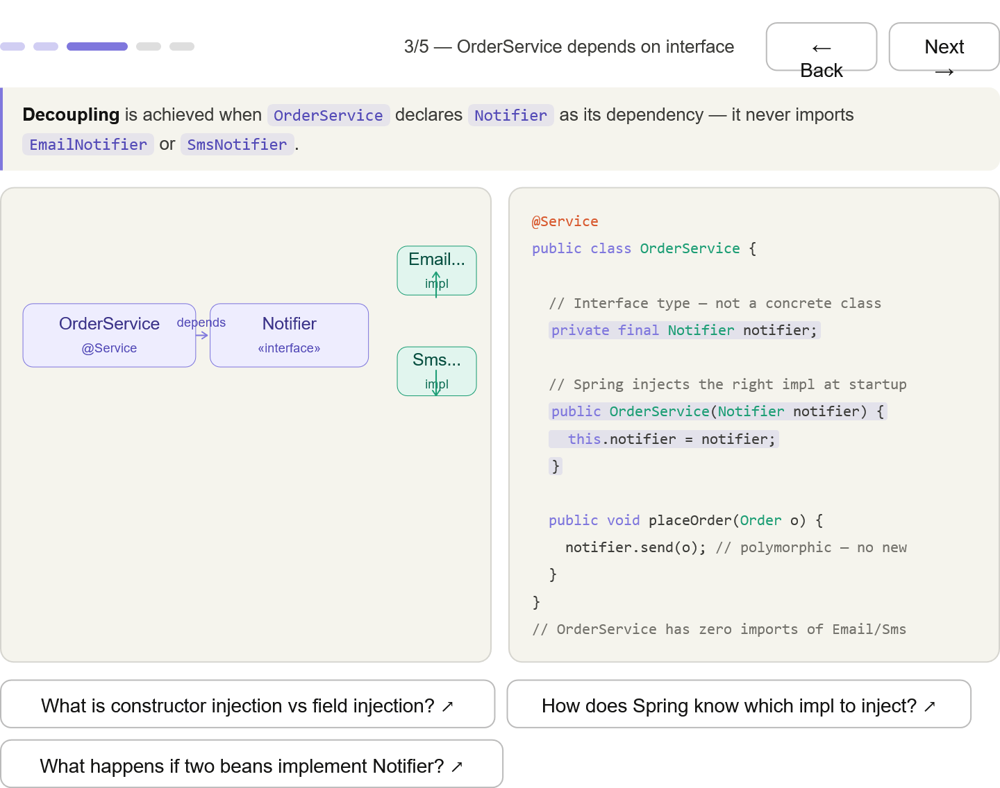
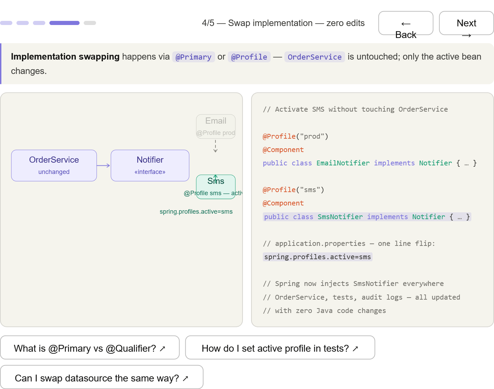
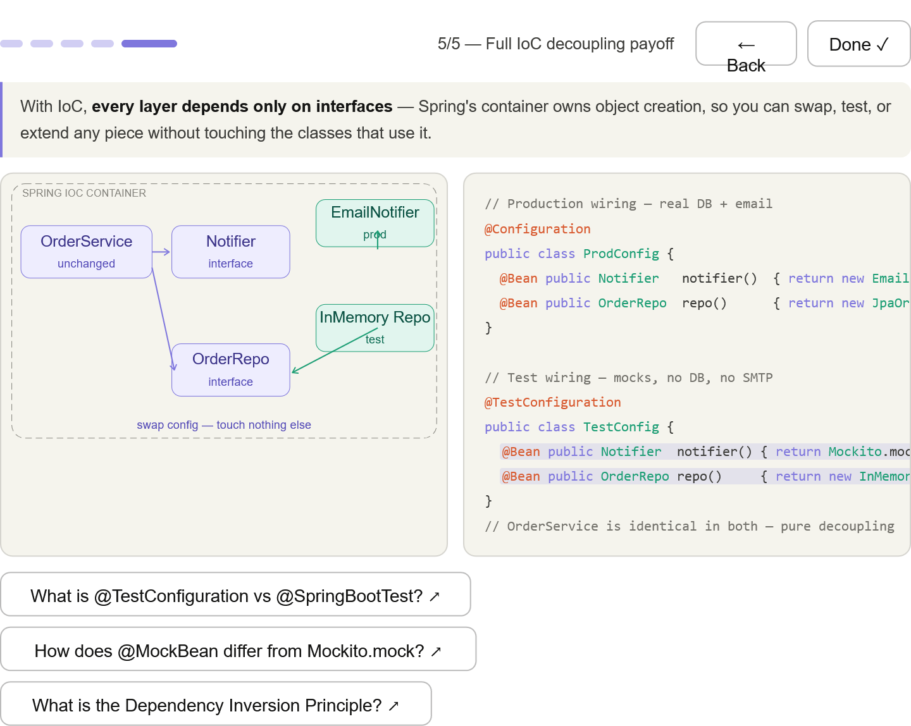

***
## Practical payoffs of Inversion of Control (IoC): Decoupling — OrderService depends on an interface, not a concrete class.Swap the implementation without touching OrderService
***
## The coupling problem — OrderService hardwires EmailNotifier with new, making SmsNotifier unreachable (shown dimmed in the diagram)

***
## Extract the interface — Notifier contract is born; both impls become interchangeable

***
## Service depends on interface — OrderService imports only Notifier, never the concrete classes

*** 
## Swap with zero edits — @Profile("sms") + one properties line flips the whole app

*** 
## Full payoff — @TestConfiguration swaps the entire wiring for tests; OrderService is byte-for-byte identical in both configs

***