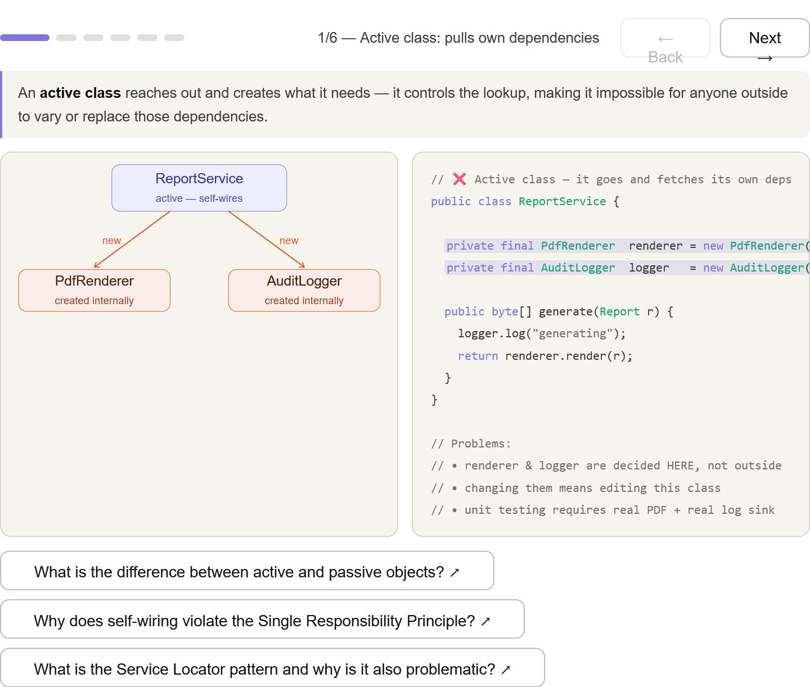
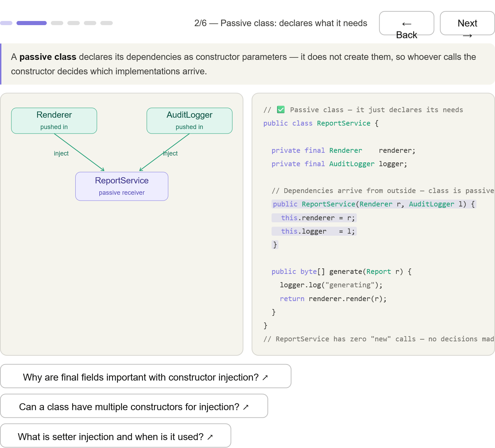
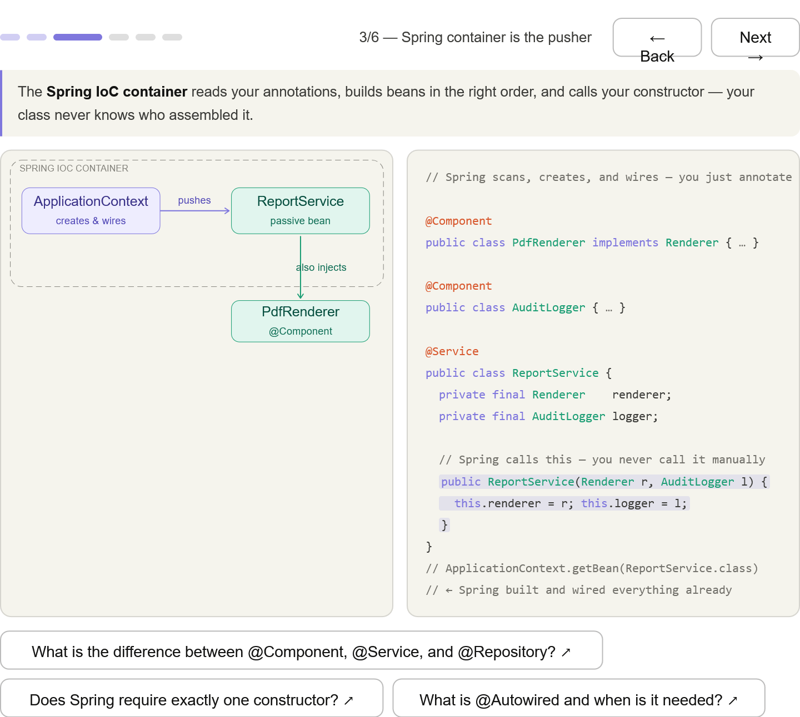
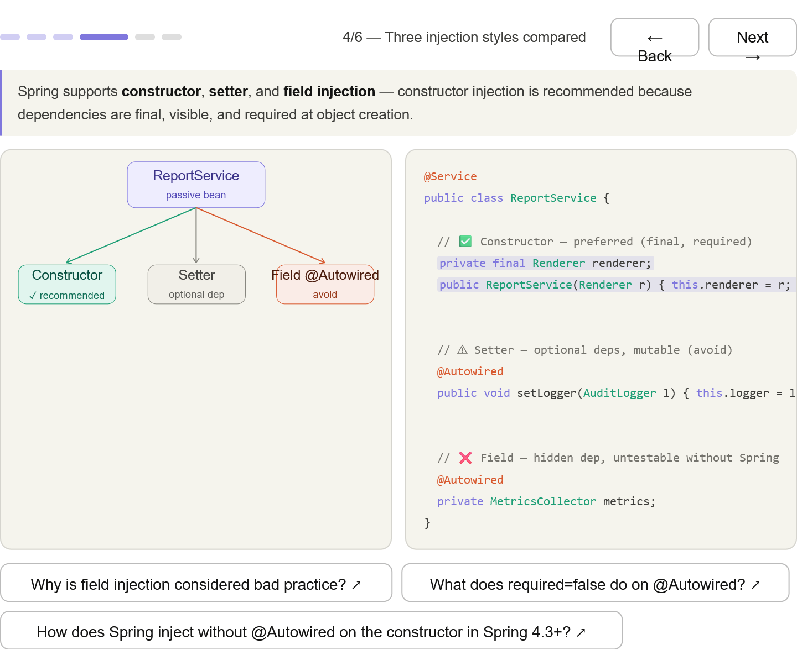
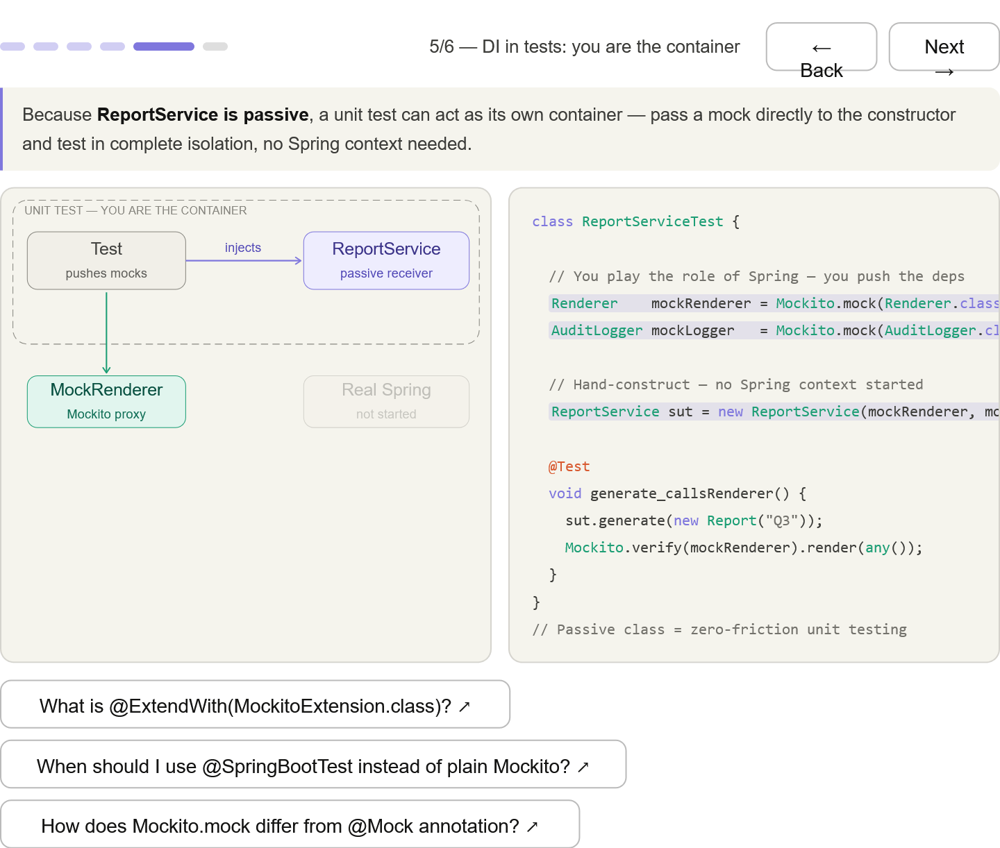
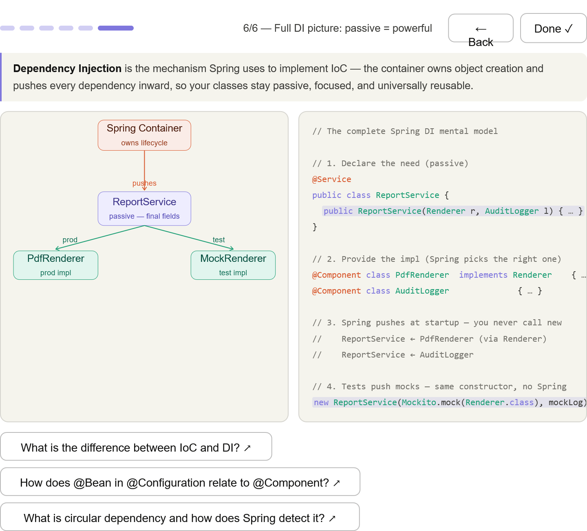

***
## Dependency Injection (DI) — the container pushes dependencies into your class. Your class is passive; it just receives what it needs
***
## Active class — arrows point outward from ReportService as it reaches out with new to grab its own deps

***
## Passive class — arrows flip inward; the class just declares a constructor and receives what arrives

***
## Spring as the pusher — the container reads annotations, builds beans in order, and calls your constructor

***
## Three injection styles — constructor (recommended), setter (optional deps), field (avoid) side-by-side

***
## Test as the mini-container — you pass mocks directly to the constructor; Spring never starts

***
## Full picture — the same constructor works for prod (Spring pushes real beans) and tests (you push mocks)
