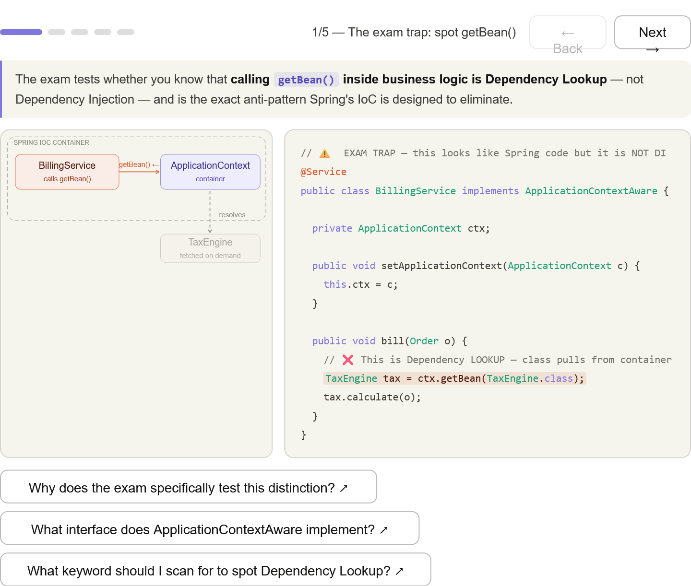
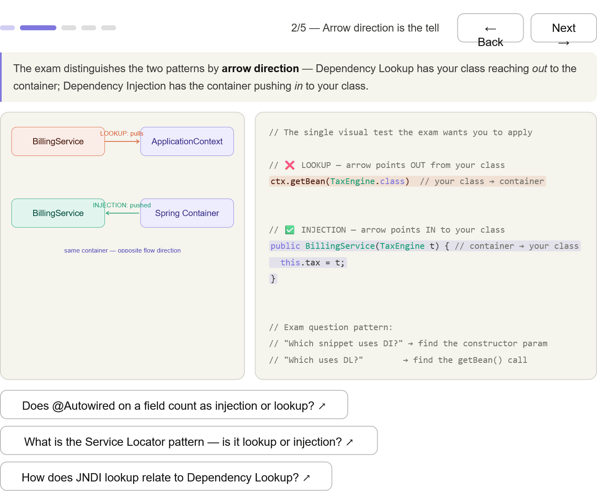
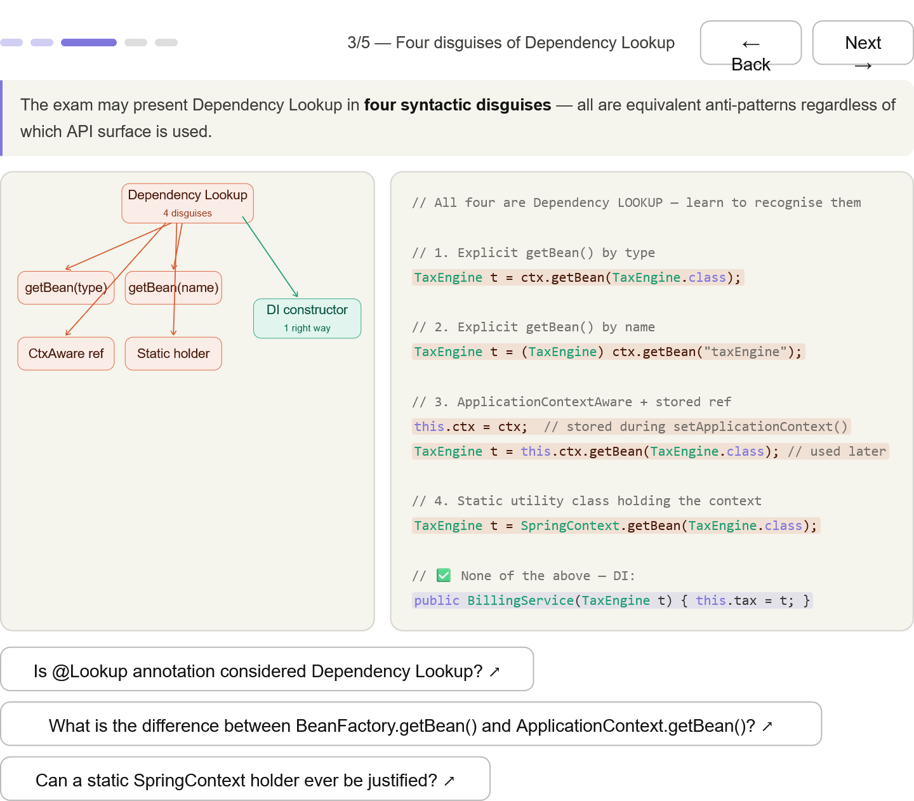
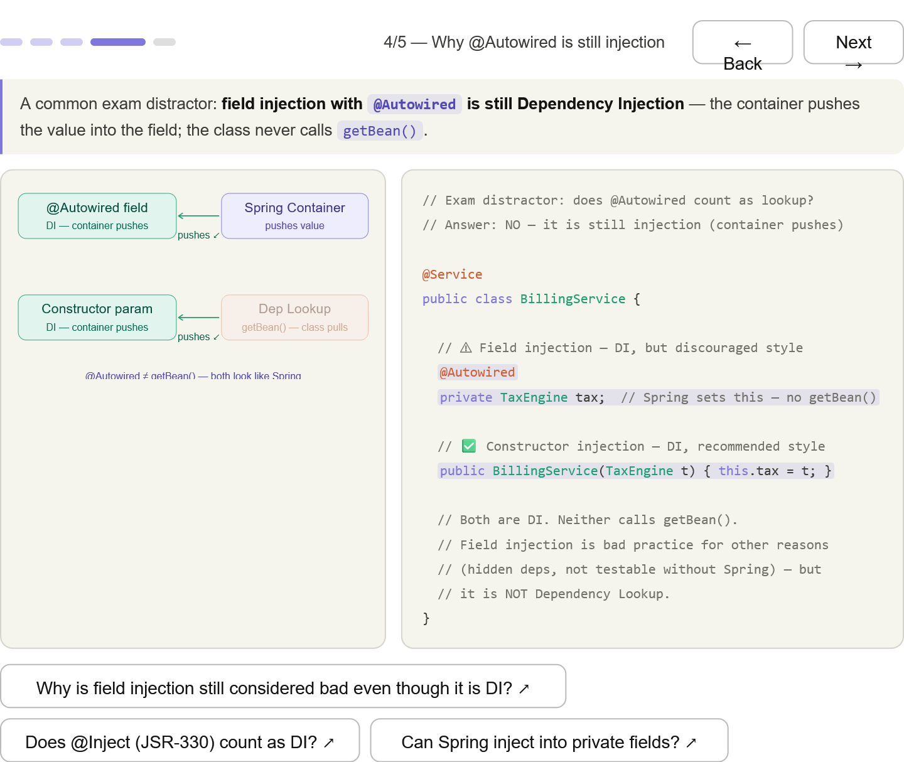
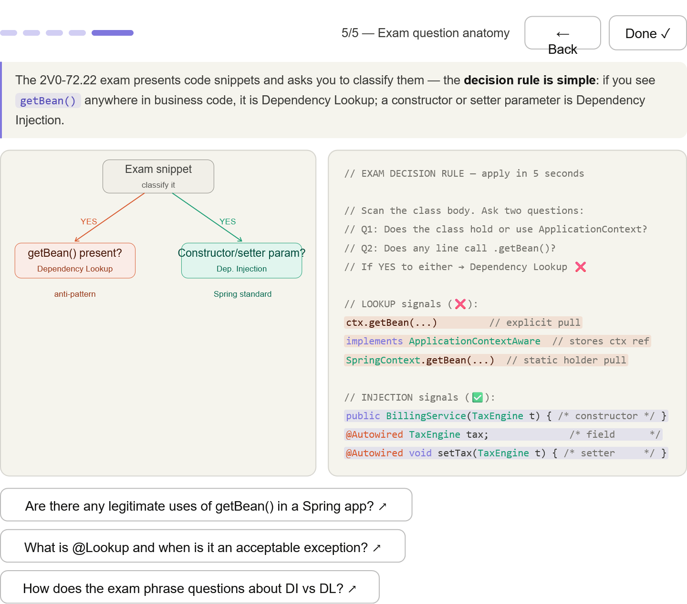

***
## Spot the trap — getBean() inside @Service with orange highlight so the anti-pattern is visually unmissable

***
## Arrow direction rule — the single fastest mental test: out = Lookup, in = Injection

***
## Four disguises — getBean(type), getBean(name), ApplicationContextAware stored ref, static holder — all coral/red; one teal DI box for contrast

***
## The @Autowired distractor — field injection looks "different" but is still DI; this is the most common wrong answer on the exam

***
## Exam decision tree — a literal 5-second flowchart: scan for getBean() → Lookup; see constructor/setter param → Injection

***

