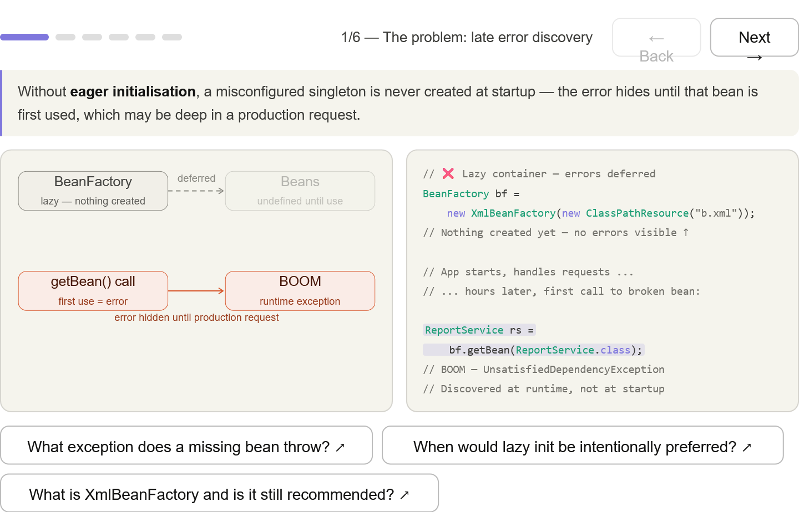
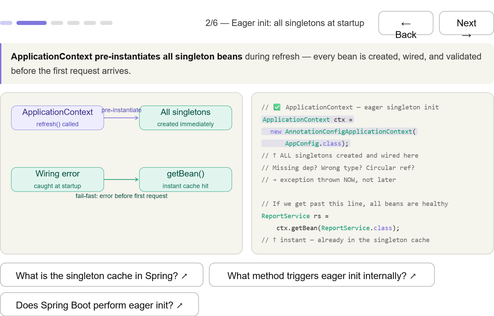
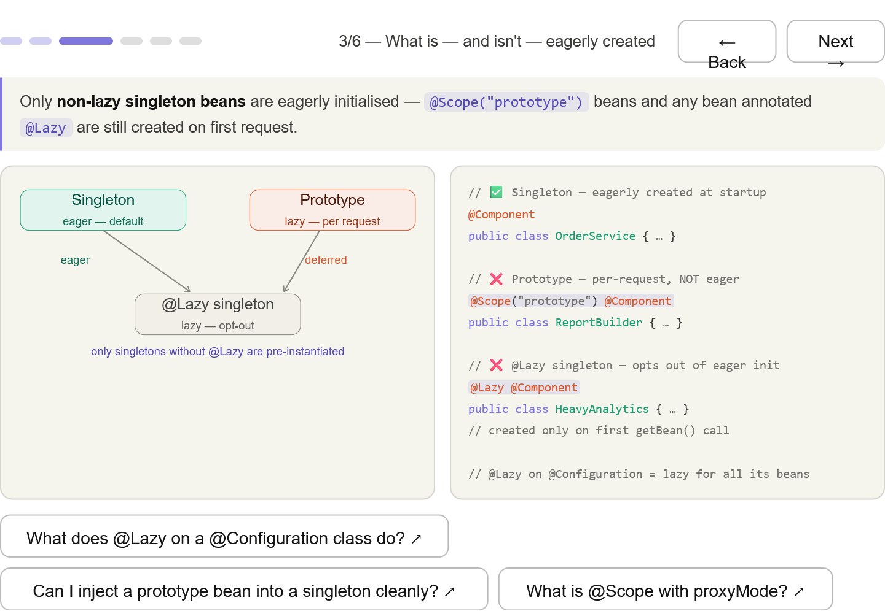
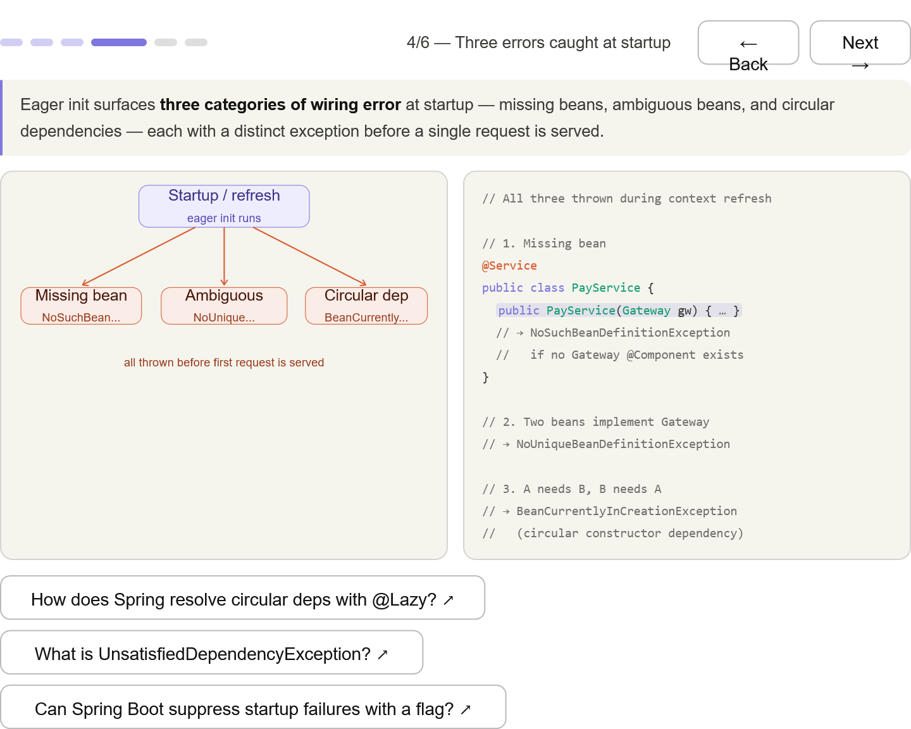
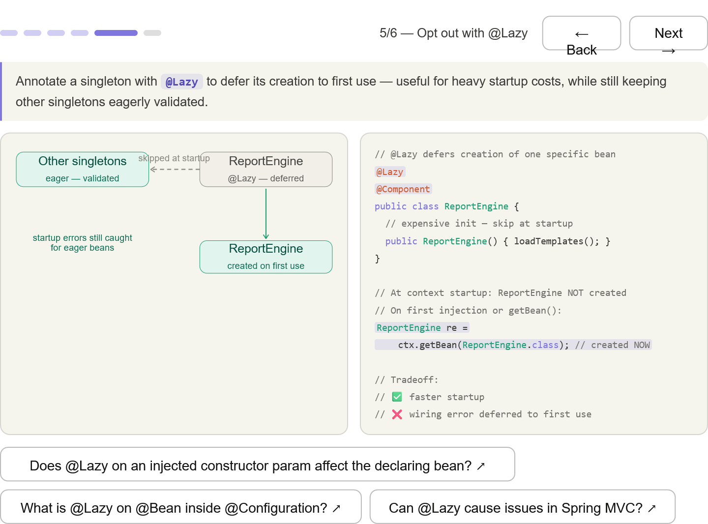
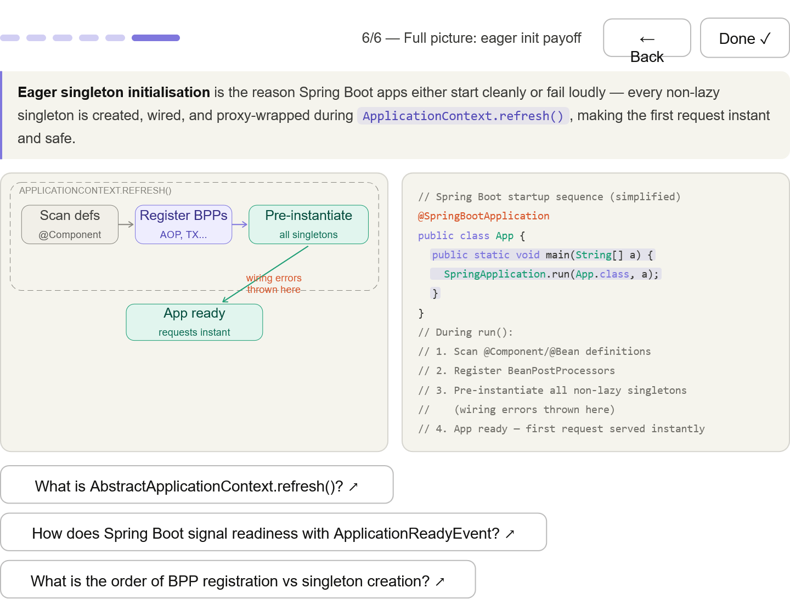

***
## The problem — lazy BeanFactory hides broken beans until first use; error surfaces at runtime in production

***
## Eager init — ApplicationContext.refresh() pre-instantiates all singletons; if you pass that line, all beans are healthy

***
## What is and isn't eager — singleton (eager), @Scope("prototype") (lazy per-request), @Lazy singleton (deferred by choice)

***
## Three errors caught at startup — NoSuchBeanDefinitionException, NoUniqueBeanDefinitionException, BeanCurrentlyInCreationException — all before request 1

***
## @Lazy opt-out — defer one heavy bean while keeping all others eagerly validated; tradeoff shown clearly

***
## Full picture — the Spring Boot startup sequence: scan → register BPPs → pre-instantiate → ready; wiring errors thrown in step 3

***