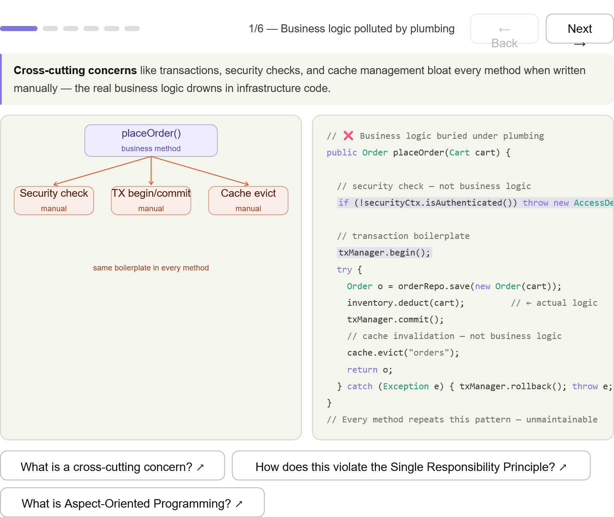
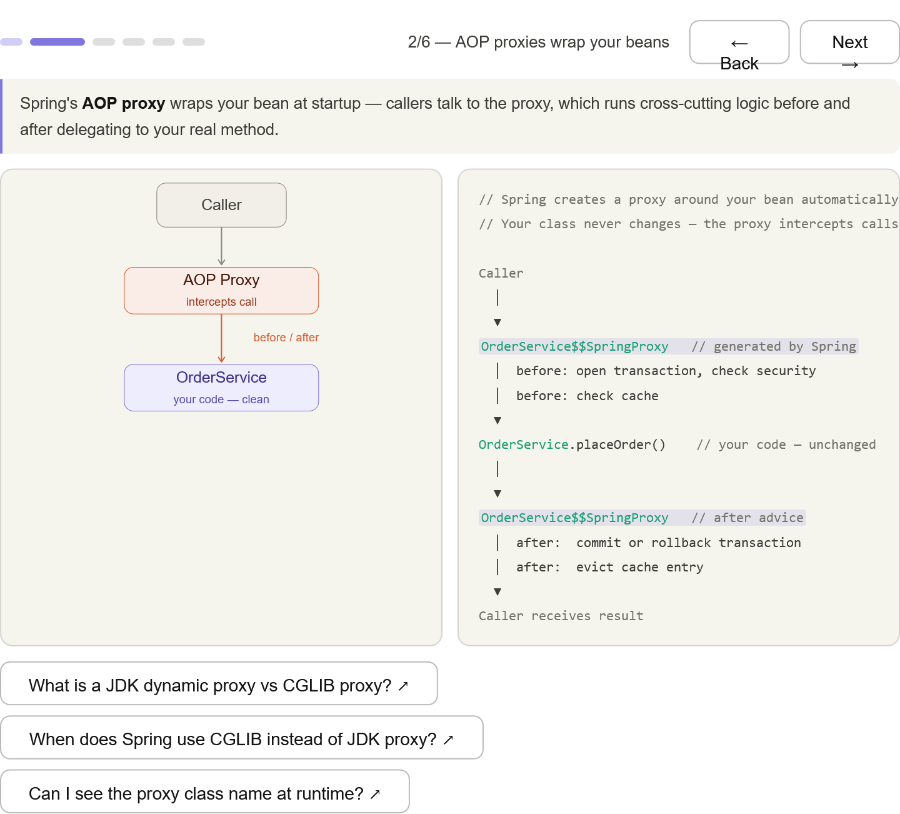
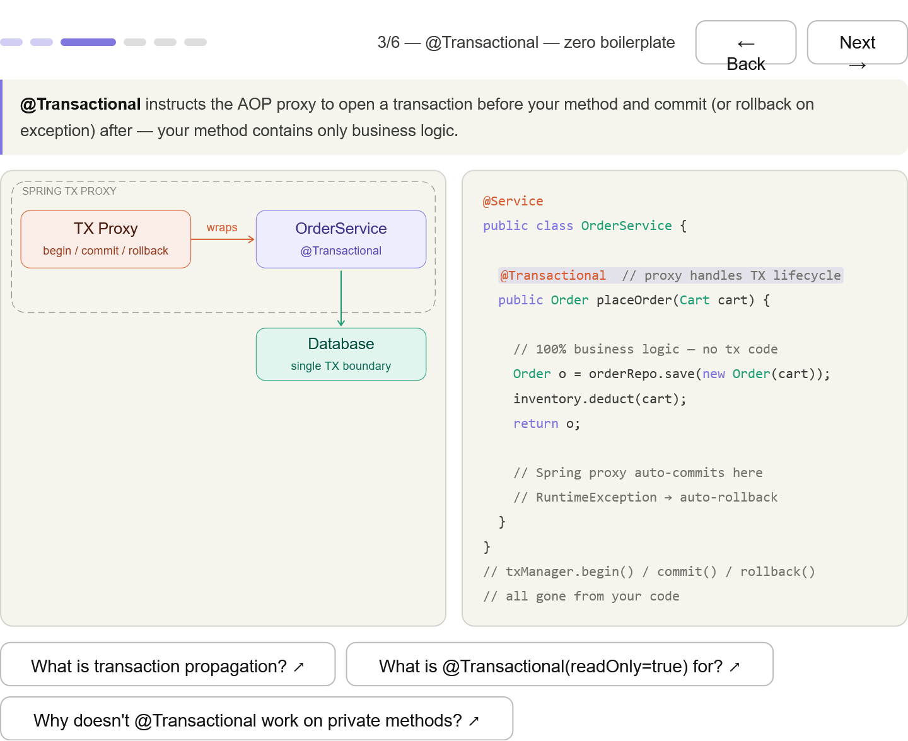
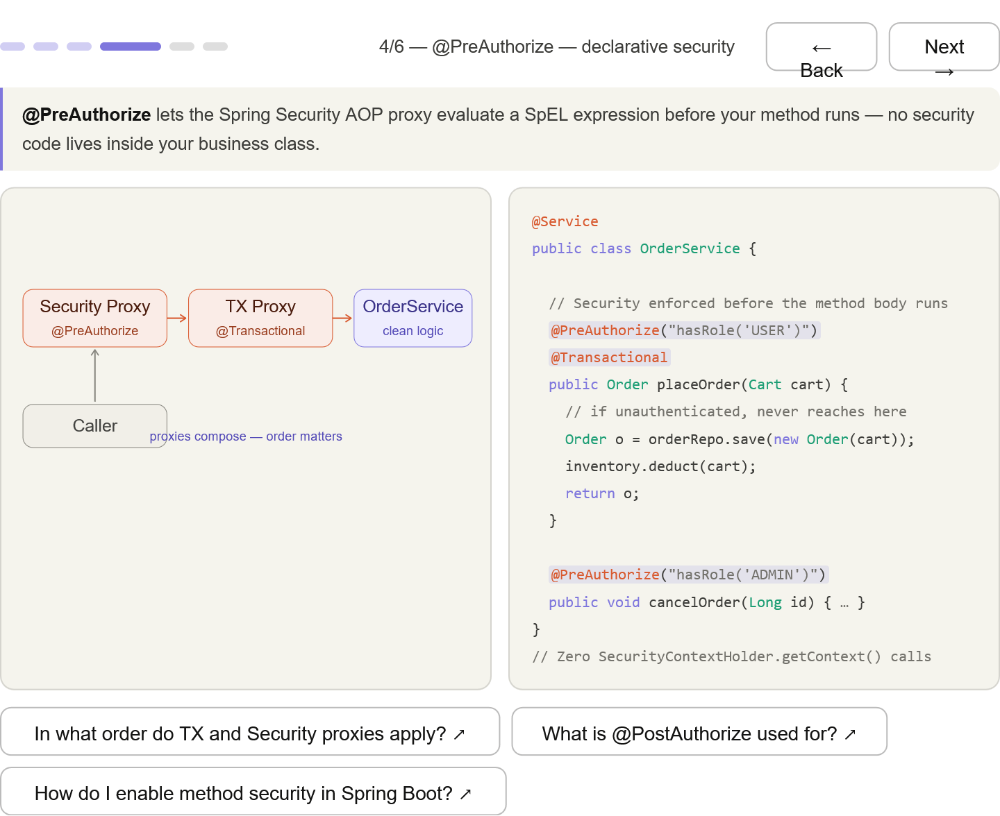
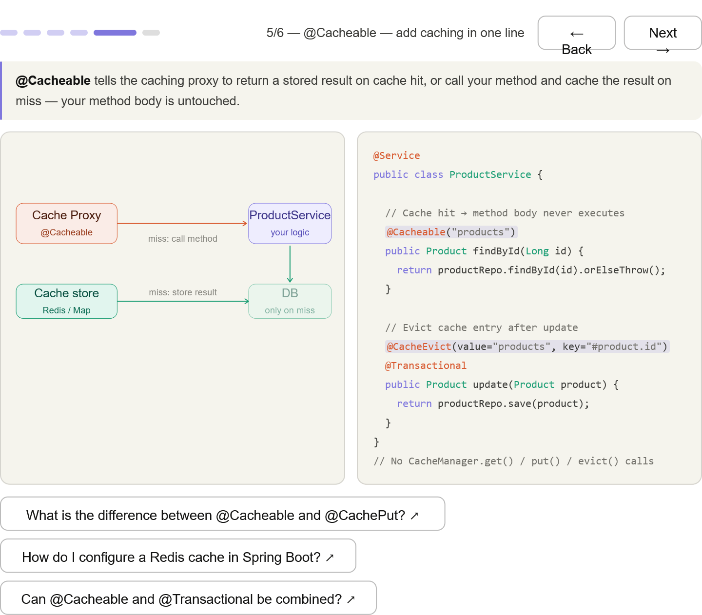
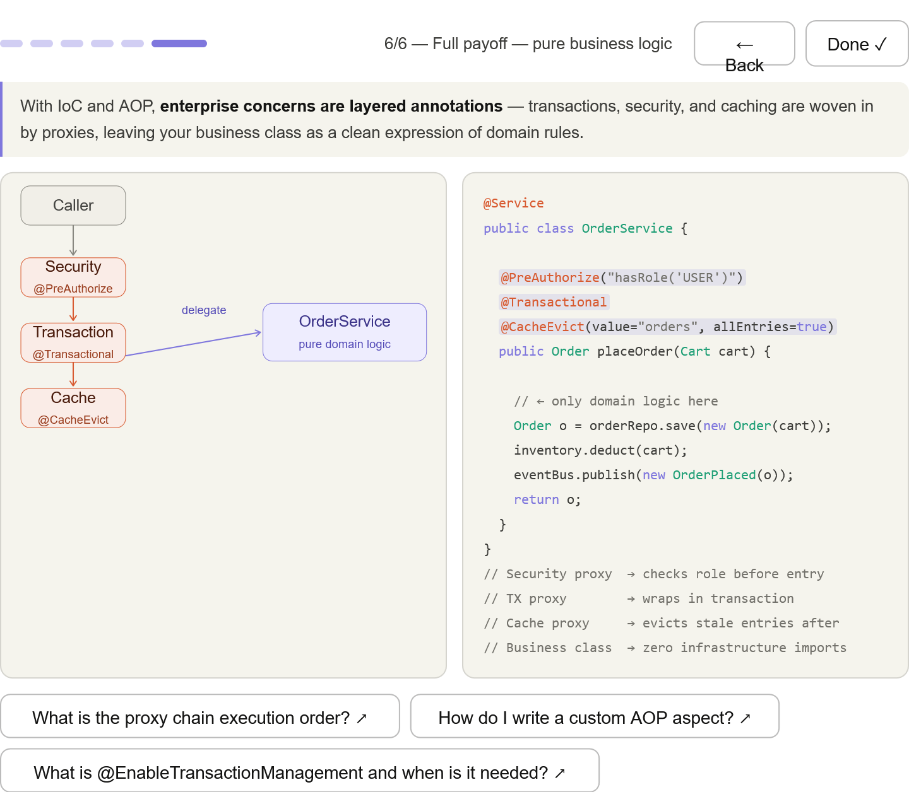

***
## Practical payoffs of Inversion of Control (IoC): Enterprise integration — transactions, security, caching, etc. can be layered on without polluting business logic
***
## The pollution problem — manual txManager.begin(), security checks, and cache evictions crammed into every method

***
## AOP proxies — how Spring wraps beans at startup so callers hit the proxy, not your class directly

***
## @Transactional — the proxy handles begin / commit / rollback; your method has zero TX code

***
## @PreAuthorize — Spring Security's proxy evaluates SpEL before entry; no SecurityContextHolder calls

***
## @Cacheable / @CacheEvict — caching proxy checks the store on entry and stores/evicts on exit

***
## Full payoff — three annotations on one method; the class body is pure domain logic with zero infrastructure imports

***