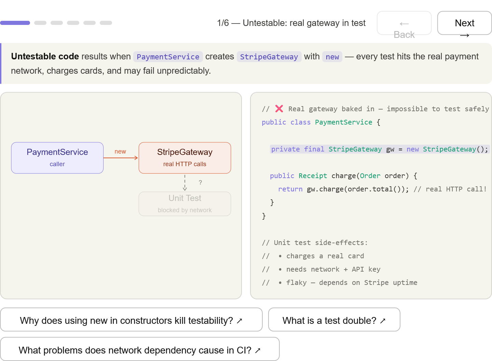
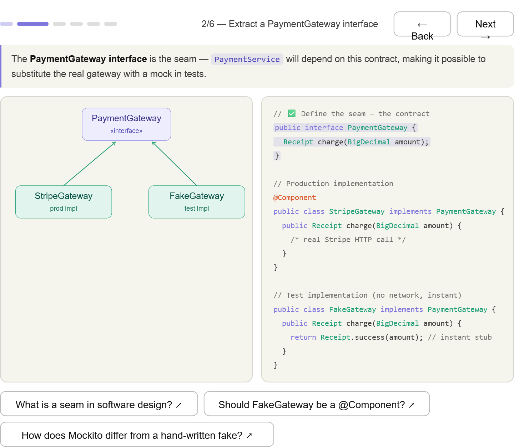
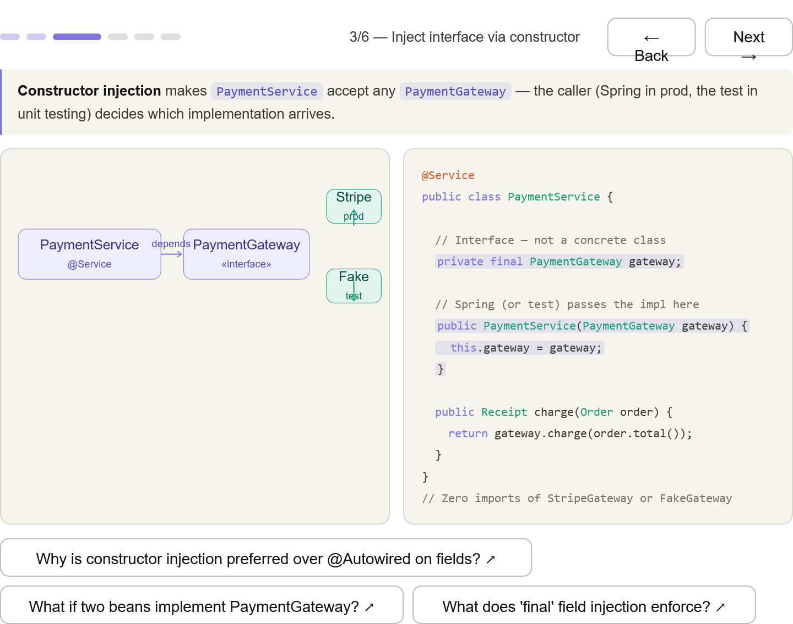
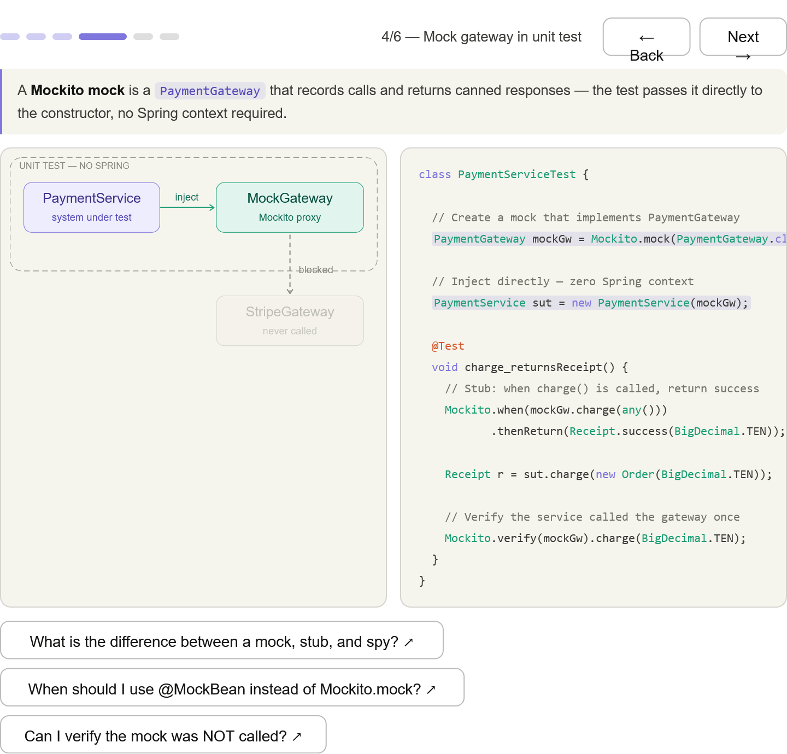
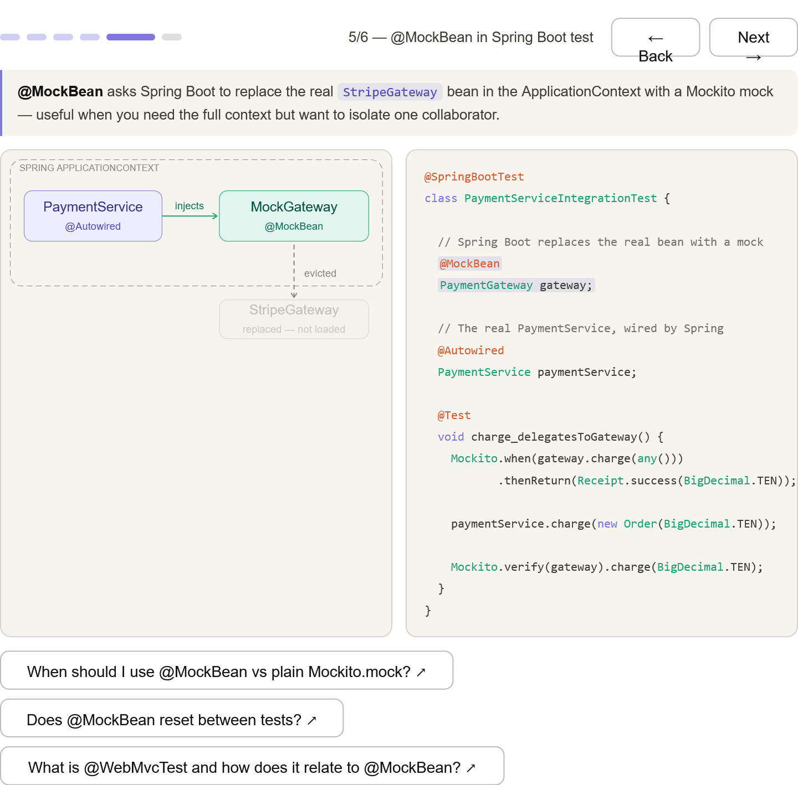
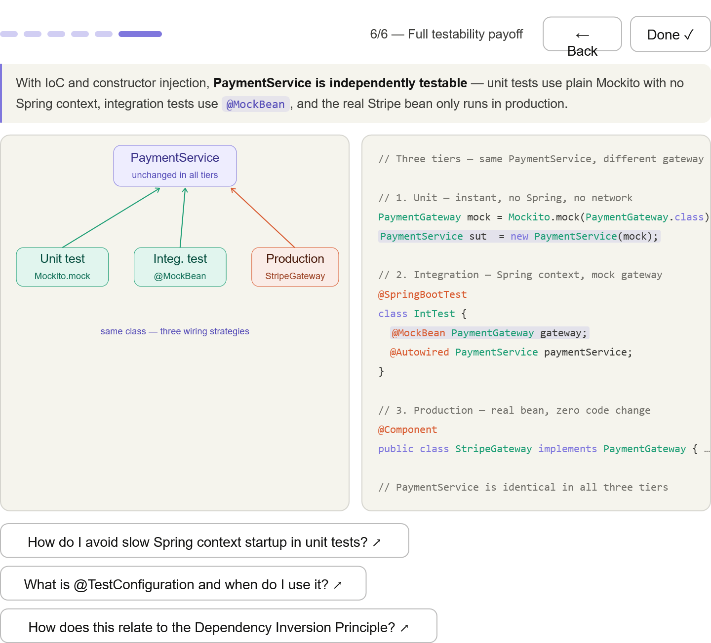

***
## The problem — new StripeGateway() inside the service means every test hits the real network (shown blocked in the diagram)

***
## Extract the seam — PaymentGateway interface splits prod and test impls cleanly

*** 
## Constructor injection — PaymentService accepts any PaymentGateway; zero concrete imports

*** 
## Plain Mockito unit test — no Spring context at all; the mock is passed directly to the constructor

***
## @MockBean integration test — Spring boots but evicts StripeGateway, replacing it with a Mockito proxy

*** 
## Full payoff — all three tiers (unit / integration / production) use the identical PaymentService class

***