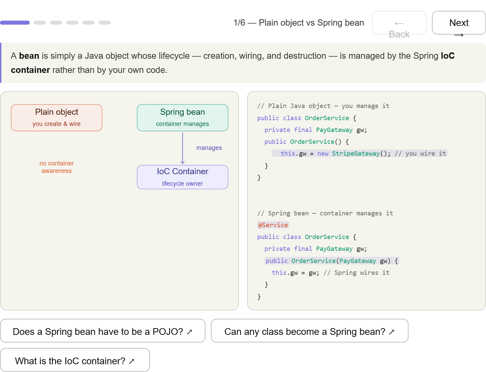
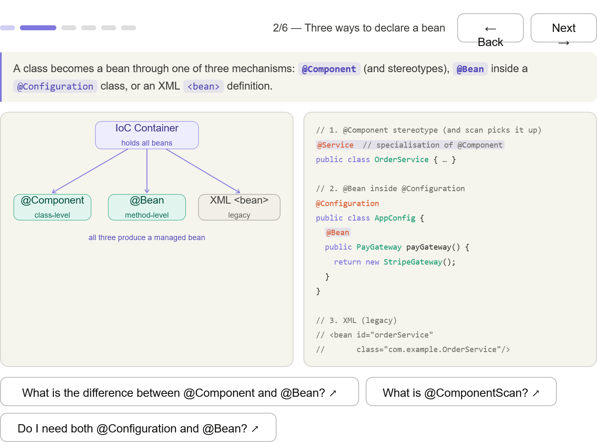
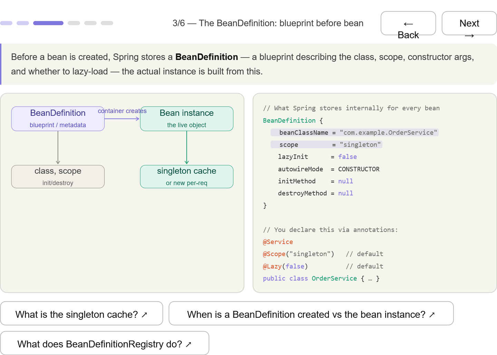
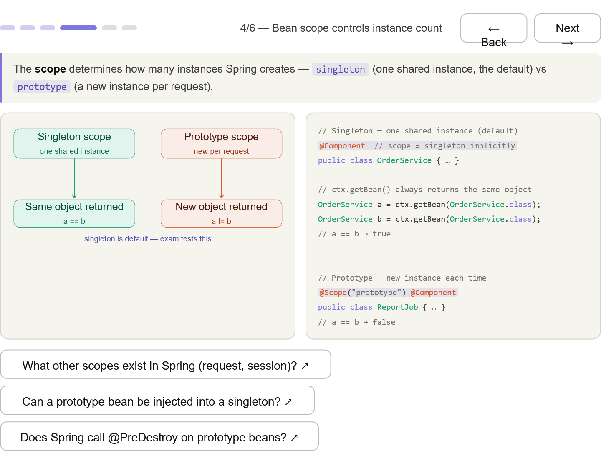
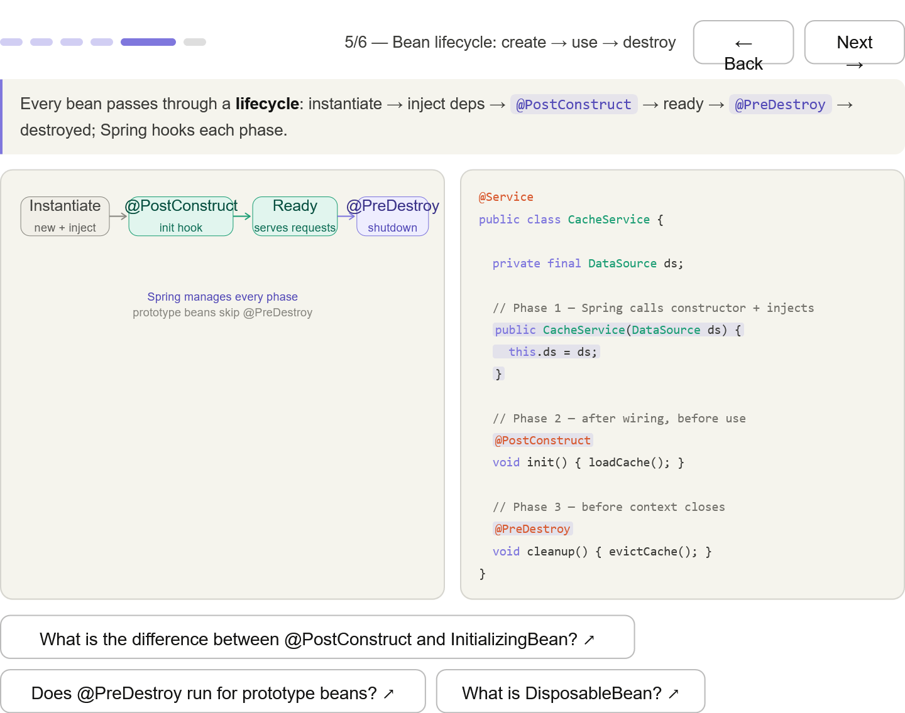
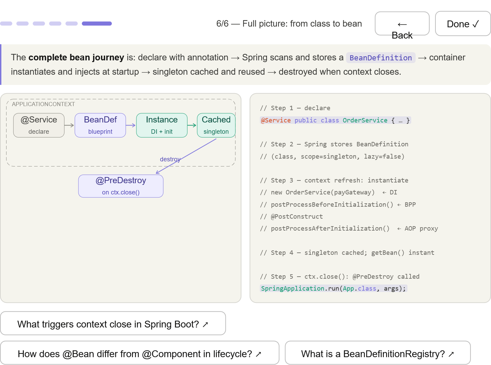

*** 
## Plain object vs bean — the single defining difference: container manages the lifecycle vs you manage it; code shows the new call removed

*** 
## Three declaration styles — @Component/stereotypes, @Bean in @Configuration, and XML; all three produce the same result

*** 
## BeanDefinition — the metadata blueprint Spring stores before creating the instance; class, scope, lazyInit, init/destroy methods

*** 
## Scope — singleton (one shared instance, a == b) vs prototype (new per request, a != b); singleton is the default

*** 
## Lifecycle hooks — constructor inject → @PostConstruct → ready → @PreDestroy; prototype beans skip @PreDestroy

*** 
## Full journey — declare → BeanDefinition → instantiate+DI+BPP hooks → singleton cache → destroy on ctx.close()
